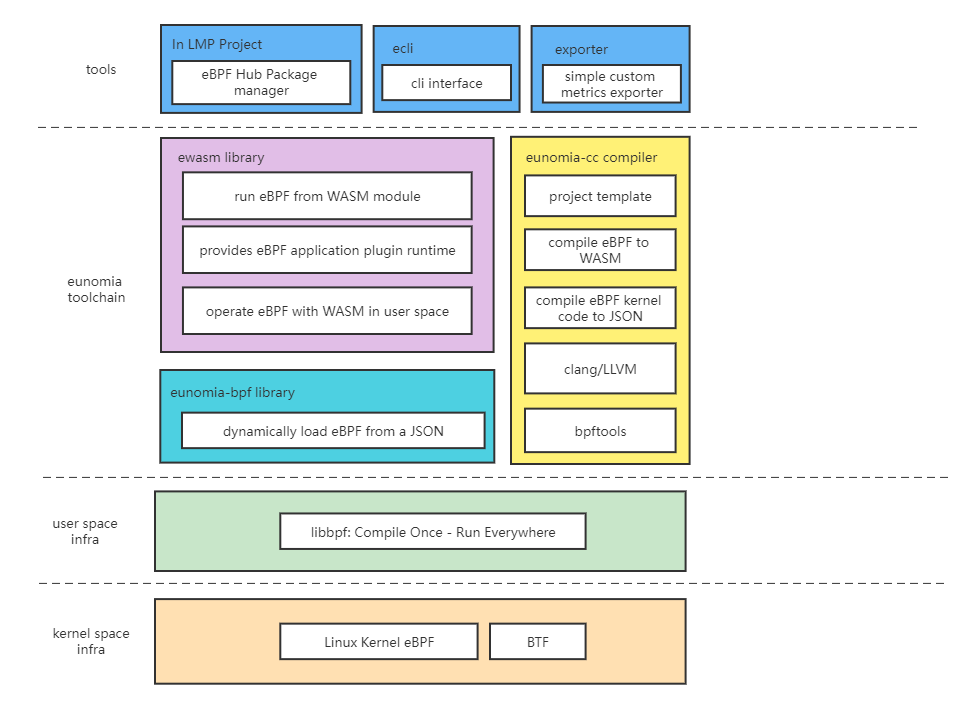

# eunomia-bpf: A library to help you build and distribute eBPF program easier

[](https://github.com/eunomia-bpf/eunomia-bpf/actions)
[](https://github.com/eunomia-bpf/eunomia-bpf/releases)
<!-- [](https://codecov.io/gh/filipdutescu/modern-cpp-template) -->

## Introduction

`eunomia-bpf` is a dynamic loading library and a compile toolchain, aim to help you build and distribute eBPF programs easier. Some command line tools are also provided to help you build, distribute and run the eBPF programs.

We have 3 main ideas:

### Write eBPF kernel code only to build CO-RE libbpf eBPF program

- Write eBPF kernel code only and automatically exposing your data with `perf event` or `ring buffer` from kernel:

    ```c
    #include <vmlinux.h>
    #include <bpf/bpf_tracing.h>
    #include <bpf/bpf_helpers.h>
    #include <bpf/bpf_core_read.h>
    #include "core_fixes.h"
    #include "mdflush.h"

    struct {
        __uint(type, BPF_MAP_TYPE_PERF_EVENT_ARRAY);
        __type(key, __u32);
        __type(value, __u32);
    } events SEC(".maps");

    SEC("fentry/md_flush_request")
    int BPF_PROG(md_flush_request, void *mddev, void *bio)
    {
        __u64 pid = bpf_get_current_pid_tgid() >> 32;
        struct event event = {};
        struct gendisk *gendisk;

        event.pid = pid;
        gendisk = get_gendisk(bio);
        BPF_CORE_READ_STR_INTO(event.disk, gendisk, disk_name);
        bpf_get_current_comm(event.comm, sizeof(event.comm));
        bpf_perf_event_output(ctx, &events, BPF_F_CURRENT_CPU, &event, sizeof(event));
        return 0;
    }

    char LICENSE[] SEC("license") = "Dual BSD/GPL";
    ```

    see [examples/bpftools/mdflush.bpf.c](examples/bpftools/mdflush/mdflush.bpf.c) for example.

- Automatically sample the data from hash maps and print them in human readable format with comments:
    
    ```c
    /// @sample {"interval": 1000, "type" : "log2_hist"}
    struct {
        __uint(type, BPF_MAP_TYPE_HASH);
        __uint(max_entries, MAX_ENTRIES);
        __type(key, u32);
        __type(value, struct hist);
    } hists SEC(".maps");
    ```

    see [examples/bpftools/mdflush.bpf.c](examples/bpftools/runqlat/runqlat.bpf.c) for example.

- Automatically generate and config command line arguments for your eBPF program from the comments in your kernel code:

    ```c
    /// Process ID to trace
    const volatile pid_t pid_target = 0;
    /// Thread ID to trace
    const volatile pid_t tgid_target = 0;
    /// @description User ID to trace
    const volatile uid_t uid_target = 0;
    /// @cmdarg {"default": false, "short": "f", "long": "failed"}
    /// @description target pid to trace
    const volatile bool targ_failed = false;
    ```

    see [examples/bpftools/opensnoop/opensnoop.bpf.c](examples/bpftools/opensnoop/opensnoop.bpf.c) for example.

- `100%` compatible with `libbpf`, [libbpf-bootstrap](https://github.com/libbpf/libbpf-bootstrap/tree/master/examples/c) and `libbpf-rs`, etc: you can compile [libbpf-tools](https://github.com/iovisor/bcc/blob/master/libbpf-tools) kernel code with `eunomia-bpf` and run them without many modification!
- Not limited to tracing: support `tracepoints`, `kprobe`, `uprobe`, `lsm`, `xdp`, `tc` etc...

### Compile and pack CO-RE eBPF kernel code to a config file

- Compile and pack CO-RE eBPF kernel code to a `JSON` or `YAML` config file:

    ```console
    $ ecc cmd/test/opensnoop.bpf.c opensnoop.h
    Compiling bpf object...
    Generating export types...
    Packing ebpf object and config into package.json...
    $ docker run -it -v `pwd`/:/src/ yunwei37/ebpm:latest # build with docker
    Packing ebpf object and config into package.json...
    ```

    You can modify the config file and config the eBPF program behavior to your need.

```yaml
bpf_skel:
  data_sections:
  - name: .rodata
    variables:
    - name: min_duration_ns
      type: unsigned long long
      value: 100
  maps:
  - ident: exec_start
    name: exec_start
    data:
      - key: 123
        value: 456
  progs:
  - attach: tp/sched/sched_process_exec
    link: true
    name: handle_exec
export_types:
- members:
  - name: pid
    type: int
  - name: ppid
    type: int
  - name: comm
    type: char[16]
  - name: exit_event
    type: bool
  name: event
  type_id: 613
```

- you can dynamically load it on different kernel version without recompile, and without clang/llvm dependency:

    ```console
    $ sudo ecli run opensnoop.json
    TIME     PID     TPID    SIG     RET     COMM    
    22:58:28  77121  3168    0       0       cpptools-srv
    22:58:29  69044  3168    0       0       cpptools-srv
    22:58:29  3014   2906    0       0       code
    22:58:29  6952   4061    0       0       node
    22:58:29  4061   3937    0       0       node
    22:58:29  75263  3168    0       0       cpptools-srv
    22:58:29  2906   2488    0       0       code
    22:58:29  69149  3168    0       0       cpptools-srv
    22:58:29  73541  3168    0       0       cpptools-srv
    22:58:29  73468  3168    0       0       cpptools-srv
    22:58:29  2906   2488    0       0       code
    22:58:29  69094  3168    0       0       cpptools-srv
    ```

- Get pre-compiled eBPF programs running from the cloud to the kernel in `1` line of bash, kernel version and architecture independent!

    ```bash
    # download the release from https://github.com/eunomia-bpf/eunomia-bpf/releases/latest/download/ecli
    $ wget https://aka.pw/bpf-ecli -O ecli && chmod +x ./ecli
    $ sudo ./ecli run https://eunomia-bpf.github.io/eunomia-bpf/sigsnoop/package.json # simply run a pre-compiled ebpf code from a url
    $ sudo ./ecli run sigsnoop:latest # run with a name and download the latest version bpf tool from our repo
    ```

- very small and simple! The library itself `<1MB` and no `LLVM/Clang` dependence, can be embedded easily in you project
- as fast as `<100ms` and little resource need to dynamically load and run eBPF program

Base on `eunomia-bpf`, we have an eBPF pacakge manager in [LMP](https://github.com/linuxkerneltravel/lmp) project, with OCI images and [ORAS](https://github.com/oras-project/oras) for distribution. 

### Write user space code for your eBPF program in WebAssembly

You can write and compile user space code for your eBPF program in WebAssembly, and run it with `eunomia-bpf`:

```bash
$ sudo ./ecli run app.wasm -h
Usage: sigsnoop [-h] [-x] [-k] [-n] [-p PID] [-s SIGNAL]
Trace standard and real-time signals.


    -h, --help  show this help message and exit
    -x, --failed  failed signals only
    -k, --killed  kill only
    -p, --pid=<int>  target pid
    -s, --signal=<int>  target signal
```

See [sigsnoop](examples/bpftools/sigsnoop/app.c), we port the user space code of `sigsnoop` tool from [BCC](https://github.com/iovisor/bcc/blob/master/libbpf-tools/sigsnoop.c) to our project as an example. 

You can operate the eBPF kernel program or process the data in user space `WASM` runtime.

Powered by WASM, an eBPF program may be able to:

- have isolation and protection for operating system resources, both user-space and kernel-space
- safely execute user-defined or community-contributed eBPF code as plug-ins in a software product
- Write eBPF programs with the language you favor, distribute and run the programs on another kernel or arch.

We have tested on `x86` and `arm` platform, more Architecture tests will be added soon.

## Project Arch

we have a loader library, a compile toolchain, and some additional tools like cli and a custom metrics exporter.



### An eunomia-bpf library

A wrapper of main functions of libbpf, provide the ability to dynamically load eBPF code to the kernel and run it with a simple JSON and a few API.

see [eunomia-bpf](eunomia-bpf) for details.

A [simple cli interface](ecli) is provided for eunomia-bpf library, which you can use it to start any eBPF program from a url in a command. You can download it from [release](https://github.com/eunomia-bpf/eunomia-bpf/releases/).

see [examples](examples) for more examples.

### A library to load and operate eBPF program from a WASM module

Use the `eunomia-bpf` library to load `eBPF` program from a `WASM` module, you can write a WASM module to operate the eBPF program or process the data in user space `WASM` runtime. The idea is simple:

1. compile the kernel eBPF code skeleton to the `JSON` format with `eunomia-cc` toolchain
2. embed the `JSON` data in the `WASM` module, and provide some API for operating the eBPF program skeleton
3. load the `JSON` data from the `WASM` module and run the eBPF program skeleton with `eunomia-bpf` library

You can have multiple `eBPF` program in a single `WASM` module.

See [ewasm](ewasm) for details. In fact, `ewasm` library only exports a few functions from `eunomia-bpf` library to the `VM`, so you can replace the `WASM` runtime with your own easily.

For example, you can run an eBPF program with a WASM module for an URL:

```bash
sudo ./ecli run https://eunomia-bpf.github.io/eunomia-bpf/sigsnoop/app.wasm
```

You can also generate a WASM program template for eBPF or build WASM module with `eunomia-cc` container:

```shell
docker run -it -v `pwd`/:/src/ yunwei37/ebpm:latest gen-wasm-skel # generate WASM app template for eBPF
docker run -it -v `pwd`/:/src/ yunwei37/ebpm:latest build-wasm    # Build WASM module
```

see [sigsnoop example](examples/bpftools/sigsnoop) for more detail.

### A compile toolchain to help you generate pre compiled eBPF data

The toolchain can be used as a docker to generate pre-compiled eBPF data in one command:

see the compile toolchains [eunomia-cc](eunomia-cc) for details.

you can also simply use the [ebpm-template](https://github.com/eunomia-bpf/ebpm-template) repo as a template in github, just push to it and github action can help you compile CO-RE ebpf code!

### other related projects

- LMP eBPF Hub: [github.com/linuxkerneltravel/lmp](https://github.com/linuxkerneltravel/lmp)

    > a package manager for eBPF based on wasm modules

- bolipi online compiler & runner: [https://bolipi.com/ebpf/home/online](https://bolipi.com/ebpf/home/online)

    > an online compiler and runner for eBPF program newbies

- An Observability tool

    > An prometheus and OpenTelemetry exporter for custom eBPF metrics, written in async rust: [eunomia-exporter](eunomia-exporter). You can compile it or download from [release](https://github.com/eunomia-bpf/eunomia-bpf/releases/)

## build the project

see [build](documents/build.md) for details.

## examples

see [examples](examples) for details about eBPF tools and library usage.

We also have a prove of concept video: [Writing eBPF programs in WASM](https://www.bilibili.com/video/BV1JN4y1A76k/).

## benchmark

see [benchmark](documents/benchmark.md) for details.

## Road-map

- [X] support `tracepoints`, `fentry`, `kprobe`, `uprobe`, `lsm` etc, and `ring buffer` / `perf event` output in userspace.
- [X] add simple pacakage manager in `OCI` `and` ORAS for eunomia-bpf: in [LMP](https://github.com/linuxkerneltravel/lmp) community
- [X] use WASM for ebpf package load config and add more user space support
- [X] support running in `ARM` and `x86`
- [ ] add more helper functions from `libbpf`
- [ ] Android support
- [ ] `riscv` support
- [ ] provide python, go and others sdk

## License

MIT LICENSE
