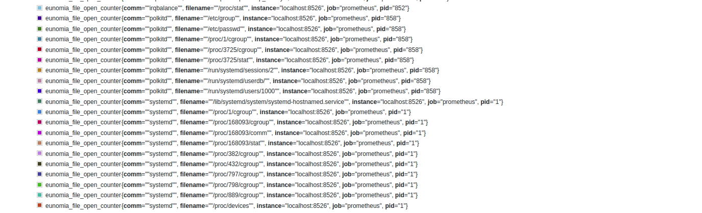

# eunomia-bpf: 一个通用的 CO-RE eBPF 编译工具链和动态加载器

[](https://github.com/eunomia-bpf/eunomia-bpf/actions)
[](https://github.com/eunomia-bpf/eunomia-bpf/releases)
<!-- [](https://codecov.io/gh/filipdutescu/modern-cpp-template) -->

## 我们的目标：提供一个通用的 CO-RE eBPF 插件扩展平台，帮助  eBPF 程序的分发和运行

eunomia-bpf 是一套编译工具链和运行时，以及一些附加项目，我们希望做到让 eBPF 程序真正像 JavaScript 或者 WASM 那样易于分发和运行

- 仅需一个数十kb的请求，包含预编译 eBPF 程序字节码和辅助信息，即可实现多种完全不同功能的 eBPF 程序的热插拔、热更新；加载时间通常为数十毫秒且内存占用少；（例如使用 [libbpf-bootstrap/bootstrap.bpf.c](https://github.com/libbpf/libbpf-bootstrap/blob/master/examples/c/bootstrap.bpf.c) ，热加载时间约为 50ms,运行时内存占用约为 5 MB，同时新增更多的 eBPF 程序通常只会增加数百 kB 的内存占用）
- 相比于传统的基于 BCC 或远程编译的分发方式，分发时间和启动时内存占用均减少了一到二个数量级；
- 运行时只需数 MB 且无 llvm、clang 依赖，即可实现一次编译、到处运行；将 eBPF 程序的编译和运行完全解耦，本地预编译好的 eBPF 程序可以直接发送到不同内核版本的远端执行；
- 大多数情况下只需要编写内核态应用程序，不需要编写任何用户态辅助框架代码, 编译工具链以镜像方式提供，不需要安装复杂的 BCC 编译环境和运行环境；
- 支持动态分发和加载 tracepoints, fentry, kprobe, lsm 等类型的大多数 eBPF 程序，也支持 ring buffer、perf event 等方式向用户态空间传递信息；
- 提供基于 async Rust 的自定义 Prometheus 或 OpenTelemetry 可观测性数据收集器，通常仅占用不到1%的资源开销；

我们采用了编译和启动运行 eBPF 程序完全分离的思路：eBPF 程序只需在开发环境编译一遍生成字节码，同时我们的编译工具链会通过源代码分析等手段从内核态的 eBPF 程序中提取少量用于在运行时进行动态加载、动态修改程序的元信息，在真正部署运行时用户态无需任何的本地或远程编译过程即可实现正确加载，和动态调整 eBPF 程序参数。

## Our function

eunomia-bpf 包含如下几个项目：

- eunomia-bpf：一个基于 libbpf 的 CO-RE eBPF 运行时库，使用 C/C++ 语言。提供 Rust 等语言的 sdk；提供 ecli 作为命令行工具；
- eunomia-cc：一个编译工具链；
- eunomia-exporter：使用 Prometheus 或 OpenTelemetry 进行可观测性数据收集，使用 Rust 编写；
- ebpm-template：使用 Github Action 进行远程编译，本地一键运行；

### 一个eunomia-bpf库

libbpf 主要功能的封装，一些用于用户开发的辅助功能。

- 提供将 ebpf 代码加载到内核并运行它的能力。
- 使用一些额外的数据来帮助加载和配置 eBPF 字节码。
- 多语言绑定：参见 [eunomia-sdks](eunomia-sdks)。 我们现在有 Rust 的 API，将来会添加更多；

#### 安装运行

大多数时候安装时只需要下载对应的二进制即可：

```bash
$ # download the release from https://github.com/eunomia-bpf/eunomia-bpf/releases/latest/download/ecli
$ wget https://aka.pw/bpf-ecli -O ecli && chmod +x ecli
```

有关详细信息，请参见 [eunomia-bpf](eunomia-bpf) 文件夹。 借助该库，我们提供了[一个简单的 cli](https://github.com/eunomia-bpf/eunomia-bpf/releases/)，在支持 eBPF 的内核版本上，您可以简单地使用 url 或路径运行预编译 eBPF 数据：

```bash
$ sudo ./ecli run https://eunomia-bpf.github.io/ebpm-template/package.json # simply run a pre-compiled ebpf code from a url
```

可以使用容器进行编译, 仅需要专注于编写[内核态代码](examples/bpftools/bootstrap/bootstrap.bpf.c):

```bash
$ docker run -it -v ./examples/bpftools/bootstrap:/src yunwei37/ebpm:latest
$ sudo ./ecli run examples/bpftools/bootstrap/package.json              # run the compiled ebpf code
```

更多的例子请参考 [examples/bpftools](examples/bpftools) 文件夹.

### 用于生成预编译 eBPF 数据的编译工具链

有关详细信息，请参阅编译工具链 [eunomia-cc](https://github.com/eunomia-bpf/eunomia-cc)。

您也可以简单地使用 [ebpm-template](https://github.com/eunomia-bpf/ebpm-template) repo 作为 github 中的模板开始编写代码，只需推送后，Github Actions 即可以帮助您编译 CO-RE ebpf 代码！

### 一个可观测性工具

An prometheus and OpenTelemetry exporter for custom eBPF metrics, written in async rust: [eunomia-exporter](eunomia-exporter)

You can compile it or download from [release](https://github.com/eunomia-bpf/eunomia-bpf/releases/)

#### example

This is an adapted version of opensnoop from [bcc/libbpf-tools](https://github.com/iovisor/bcc/blob/master/libbpf-tools/opensnoop.bpf.c), you can check our source code here: [examples/bpftools/opensnoop](examples/bpftools/opensnoop)

After compile the eBPF code, you can define a config file like this:

```yml
programs:
- name: opensnoop
  metrics:
    counters:
    - name: eunomia_file_open_counter
      description: test
      labels:
      - name: pid
      - name: comm
      - name: filename
        from: fname
  compiled_ebpf_filename: examples/bpftools/opensnoop/package.json
```

然后，您可以在任何地方使用 `config.yaml` 和预编译的 eBPF 数据 `package.json` 启动 Prometheus 导出器，您可以看到如下指标：



您可以在任何内核版本上部署导出器，而无需依赖 `LLVM/Clang`。 有关详细信息，请参阅 [eunomia-exporter](eunomia-exporter/README.md)。

## 计划路线图

- [X] 重构 `Eunomia` 项目中的代码并提供快速示例
- [X] 支持用户空间中的`tracepoints`、`fentry`、`kprobe`、`lsm`和`ring buffer`/`perf event`输出。
- [X] 使编译更容易使用，更灵活，完全兼容其他 libbpf 程序；
- [X] 添加可配置的可观测性导出器
- [ ] 使用 lua 进行 ebpf 包加载配置，并添加更多 ebpf 程序类型支持
- [ ] 支持更多的 ebpf 程序类型：
- [ ] 为 eunomia-bpf 添加简单的包管理器
- [ ] 从 `libbpf` 添加更多可能性
- [ ] 提供 python、go 等 sdk
- [ ] 添加对 `etcd` 的支持并增强服务器
- [ ] 修复 ci 和 docs

## License

MIT LICENSE

