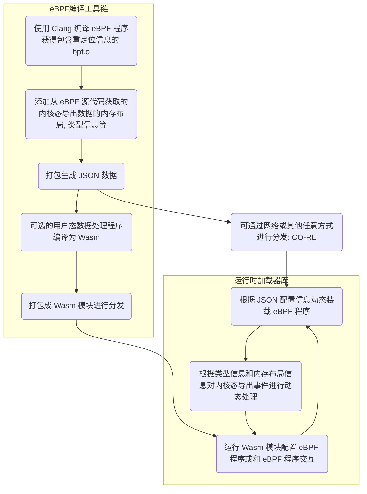

# eunomia-bpf 用户手册: 让 eBPF 程序的开发和部署尽可能简单

<!-- TOC -->

- [eunomia-bpf 用户手册: 让 eBPF 程序的开发和部署尽可能简单](#eunomia-bpf-用户手册-让-ebpf-程序的开发和部署尽可能简单)
  - [从 _C 语言_ 的 Hello World 开始](#从-c-语言-的-hello-world-开始)
  - [eunomia-bpf 的 Hello World](#eunomia-bpf-的-hello-world)
  - [添加 map 记录数据](#添加-map-记录数据)
  - [使用 ring buffer 往用户态发送数据](#使用-ring-buffer-往用户态发送数据)
  - [使用 perf event array 往用户态发送数据](#使用-perf-event-array-往用户态发送数据)
  - [使用 github-template 实现远程编译](#使用-github-template-实现远程编译)
  - [通过 API 进行热插拔和分发](#通过-api-进行热插拔和分发)
  - [使用 Prometheus 或 OpenTelemetry 进行可观测性数据收集](#使用-prometheus-或-opentelemetry-进行可观测性数据收集)
    - [example](#example)
  - [使用 Wasm 模块分发、动态加载 eBPF 程序](#使用-wasm-模块分发动态加载-ebpf-程序)
  - [使用 Wasm 开发和打包 eBPF 程序](#使用-wasm-开发和打包-ebpf-程序)
    - [bootstrap](#bootstrap)
    - [编写内核态的 eBPF 程序](#编写内核态的-ebpf-程序)
    - [构建用户态的 Wasm 代码，并获取内核态数据](#构建用户态的-wasm-代码并获取内核态数据)
    - [bootstrap](#bootstrap-1)
    - [编写内核态的 eBPF 程序](#编写内核态的-ebpf-程序-1)
    - [构建用户态的 Wasm 代码，并获取内核态数据](#构建用户态的-wasm-代码并获取内核态数据-1)
    - [从用户态程序中访问和更新 eBPF 程序的 map 数据](#从用户态程序中访问和更新-ebpf-程序的-map-数据)
    - [从用户态程序中访问和更新 eBPF 程序的 map 数据](#从用户态程序中访问和更新-ebpf-程序的-map-数据-1)
    - [更多的例子：socket filter 和 lsm](#更多的例子socket-filter-和-lsm)
  - [演示视频](#演示视频)
  - [原理](#原理)
  - [为我们的项目贡献代码](#为我们的项目贡献代码)

<!-- /TOC -->

传统来说， eBPF 的开发方式主要有 BCC、libbpf 等方式。要完成一个 BPF 二进制程序的开发，需要搭建开发编译环境，要关注目标系统的内核版本情况，需要掌握从 BPF 内核态到用户态程序的编写，以及如何加载、绑定至对应的 HOOK 点等待事件触发，最后再对输出的日志及数据进行处理。

我们希望有这样一种 eBPF 的编译和运行工具链，就像其他很多语言一样：

- 大多数用户只需要关注 `bpf.c` 程序本身的编写，不需要写任何其他的什么 Python, Clang 之类的用户态辅助代码框架；
  这样我们可以很方便地分发、重用 eBPF 程序本身，而不需要和某种或几种语言的生态绑定；

- 最大程度上和主流的 libbpf 框架实现兼容，原先使用 libbpf 框架编写的代码几乎不需要改动即可移植；eunomia-bpf 编写的 eBPF 程序也可以使用 libbpf 框架来直接编译运行；

- 本地只需要下载一个很小的二进制运行时，没有任何的 Clang LLVM 之类的大型依赖，可以支持热插拔、热更新；
  也可以作为 Lua 虚拟机那样的小模块直接编译嵌入其他的大型软件中，提供 eBPF 程序本身的服务；运行和启动时资源占用率都很低；

- 让 eBPF 程序的分发和使用像网页和 Web 服务一样自然（Make eBPF as a service）：
  支持在集群环境中直接通过一次请求进行分发和热更新，仅需数十 kB 的 payload，
  <100ms 的更新时间，和少量的 CPU 内存占用即可完成 eBPF 程序的分发、部署和更新；
  不需要执行额外的编译过程，就能得到 CO-RE 的运行效率；

## 从 _C 语言_ 的 Hello World 开始

还记得您第一次写 _C 语言_ 的 **Hello World 程序** 吗？首先，我们需要一个 `.c` 文件，它包含一个 `main` 函数：

```c
int main(void)
{
    printf("Hello, World!\n");
    return 0;
}
```

我们叫它 `hello.c`，接下来就只需要这几个步骤就好：

```bash
# if you are using Ubuntu without a c compiler
sudo apt insalll build-essentials
# compile the program
gcc -o hello hello.c
# run the program
./hello
```

只需要写一个 c 文件，执行两行命令就可以运行；大多数情况下你也可以把编译好的可执行文件直接移动到其他同样架构的机器或不同版本的操作系统上，然后运行它，也会得到一样的结果:

```plaintext
Hello World!
```

## eunomia-bpf 的 Hello World

首先，我们需要一个 `bpf.c` 文件，它就是正常的、合法的 C 语言代码，和 libbpf 所使用的完全相同：

```c
#include <linux/bpf.h>
#include <bpf/bpf_helpers.h>
#include <bpf/bpf_tracing.h>

typedef int pid_t;

char LICENSE[] SEC("license") = "Dual BSD/GPL";

SEC("tp/syscalls/sys_enter_write")
int handle_tp(void *ctx)
{
 pid_t pid = bpf_get_current_pid_tgid() >> 32;
 bpf_printk("BPF triggered from PID %d.\n", pid);
 return 0;
}
```

假设它叫 `hello.bpf.c`，新建一个 `/path/to/repo` 的文件夹并且把它放进去，接下来的步骤：

```console
# 下载安装 ecli 二进制
wget https://aka.pw/bpf-ecli -O /usr/local/ecli && chmod +x /usr/local/ecli
# 使用容器进行编译，生成一个 package.json 文件，里面是已经编译好的代码和一些辅助信息
docker run -it -v /path/to/repo:/src yunwei37/ebpm:latest
# 运行 eBPF 程序（root shell）
sudo ecli run package.json
```

> 使用 docker 的时候需要把包含 .bpf.c 文件的目录挂载到容器的 /src 目录下，目录中只有一个 .bpf.c 文件；

它会追踪所有进行 write 系统调用的进程的 pid：

```console
$ sudo cat /sys/kernel/debug/tracing/trace_pipe
cat-42755   [003] d...1 48755.529860: bpf_trace_printk: BPF triggered from PID 42755.
             cat-42755   [003] d...1 48755.529874: bpf_trace_printk: BPF triggered from PID 42755.
```

我们编译好的 eBPF 代码同样可以适配多种内核版本，可以直接把 package.json 复制到另外一个机器上，然后不需要重新编译就可以直接运行（CO-RE：Compile Once Run Every Where）；也可以通过网络传输和分发 package.json，通常情况下，压缩后的版本只有几 kb 到几十 kb。

## 添加 map 记录数据

参考：<https://github.com/eunomia-bpf/eunomia-bpf/tree/master/examples/bpftools/bootstrap>

```c

struct {
 __uint(type, BPF_MAP_TYPE_HASH);
 __uint(max_entries, 8192);
 __type(key, pid_t);
 __type(value, u64);
} exec_start SEC(".maps");

```

添加 map 的功能和 libbpf 没有任何区别，只需要在 .bpf.c 中定义即可。

## 使用 ring buffer 往用户态发送数据

参考：<https://github.com/eunomia-bpf/eunomia-bpf/tree/master/examples/bpftools/bootstrap>

只需要定义一个头文件，包含你想要发送给用户态的数据格式，以 `.h` 作为后缀名：

```c
/* SPDX-License-Identifier: (LGPL-2.1 OR BSD-2-Clause) */
/* Copyright (c) 2020 Facebook */
#ifndef __BOOTSTRAP_H
#define __BOOTSTRAP_H

#define TASK_COMM_LEN 16
#define MAX_FILENAME_LEN 127

struct event {
 int pid;
 int ppid;
 unsigned exit_code;
 unsigned long long duration_ns;
 char comm[TASK_COMM_LEN];
 char filename[MAX_FILENAME_LEN];
 unsigned char exit_event;
};

#endif /* __BOOTSTRAP_H */
```

在代码中定义环形缓冲区之后，就可以直接使用它：

```c
struct {
 __uint(type, BPF_MAP_TYPE_RINGBUF);
 __uint(max_entries, 256 * 1024);
} rb SEC(".maps");

SEC("tp/sched/sched_process_exec")
int handle_exec(struct trace_event_raw_sched_process_exec *ctx)
{
    ......
 e->exit_event = false;
 e->pid = pid;
 e->ppid = BPF_CORE_READ(task, real_parent, tgid);
 bpf_get_current_comm(&e->comm, sizeof(e->comm));
 /* successfully submit it to user-space for post-processing */
 bpf_ringbuf_submit(e, 0);
 return 0;
}
```

eunomia-bpf 会自动去源代码中找到对应的 ring buffer map，并且把 ring buffer 和类型信息记录在编译好的信息中，并在运行的时候自动完成对于 ring buffer 的加载、导出事件等工作。所有的 eBPF 代码和原生的 libbpf 程序没有任何区别，使用 eunomia-bpf 开发的代码也可以在 libbpf 中无需任何改动即可编译运行。

## 使用 perf event array 往用户态发送数据

使用 perf event 的原理和使用 ring buffer 非常类似，使用我们的框架时，也只需要在头文件中定义好所需导出的事件，然后定义一下 perf event map：

```c
struct {
 __uint(type, BPF_MAP_TYPE_PERF_EVENT_ARRAY);
 __uint(key_size, sizeof(u32));
 __uint(value_size, sizeof(u32));
} events SEC(".maps");
```

可以参考：<https://github.com/eunomia-bpf/eunomia-bpf/tree/master/examples/bpftools/opensnoop> 它是直接从 libbpf-tools 中移植的实现；

## 使用 github-template 实现远程编译

由于 eunomia-bpf 的编译和运行阶段完全分离，可以实现在 github 网页上编辑之后，通过 github actions 来完成编译，之后在本地一行命令即可启动：

1. 将此 [github.com/eunomia-bpf/ebpm-template](https://github.com/eunomia-bpf/ebpm-template) 用作 github 模板：请参阅 [creating-a-repository-from-a-template](https://docs.github.com/en/repositories/creating-and-managing-repositories/creating-a-repository-from-a-template)
2. 修改 bootstrap.bpf.c， commit 并等待工作流停止
3. 我们配置了 github pages 来完成编译好的 json 的导出，之后就可以实现 ecli 使用远程 url 一行命令即可运行：

```console
sudo ./ecli run https://eunomia-bpf.github.io/ebpm-template/package.json
```

## 通过 API 进行热插拔和分发

由于 eunomia-cc 编译出来的 ebpf 程序代码和附加信息很小（约数十 kb），且不需要同时传递任何的额外依赖，因此我们可以非常方便地通过网络 API 直接进行分发，也可以在很短的时间（大约 100ms）内实现热插拔和热更新。我们提供了一个简单的 client 和 server，请参考;

[https://github.com/eunomia-bpf/eunomia-bpf/blob/master/documents/ecli-usage.md](https://github.com/eunomia-bpf/eunomia-bpf/blob/master/documents/ecli-usage.md)

之前也有一篇比赛项目的可行性验证的文章：

[https://zhuanlan.zhihu.com/p/555362934](https://zhuanlan.zhihu.com/p/555362934)

## 使用 Prometheus 或 OpenTelemetry 进行可观测性数据收集

基于 async Rust 的 Prometheus 或 OpenTelemetry 自定义可观测性数据收集器: [eunomia-exporter](https://github.com/eunomia-bpf/eunomia-bpf/tree/master/eunomia-exporter)

可以自行编译或通过 [release](https://github.com/eunomia-bpf/eunomia-bpf/releases/) 下载

### example

这是一个 `opensnoop` 程序，追踪所有的打开文件，源代码来自 [bcc/libbpf-tools](https://github.com/iovisor/bcc/blob/master/libbpf-tools/opensnoop.bpf.c), 我们修改过后的源代码在这里: [examples/bpftools/opensnoop](https://github.com/eunomia-bpf/eunomia-bpf/tree/master/examples/bpftools/opensnoop)

在编译之后，可以定义一个这样的配置文件:

```yml
programs:
  - name: opensnoop
    metrics:
      counters:
        - name: eunomia_file_open_counter
          description: test
          labels:
            - name: pid
            - name: comm
            - name: filename
              from: fname
    compiled_ebpf_filename: examples/bpftools/opensnoop/package.json
```

然后，您可以在任何地方使用 `config.yaml` 和预编译的 eBPF 数据 `package.json` 启动 Prometheus 导出器，您可以看到如下指标：


您可以在任何内核版本上部署导出器，而无需依赖 `LLVM/Clang`。 有关详细信息，请参阅 [eunomia-exporter](https://github.com/eunomia-bpf/eunomia-bpf/tree/master/eunomia-exporter)。

## 使用 Wasm 模块分发、动态加载 eBPF 程序

借助 Wasm-bpf 编译工具链和运行时，我们可以使用 Wasm 将 eBPF 程序编写为跨平台的模块，同时使用 C/C++ 或 Rust 来编写 Wasm 程序。通过在 WebAssembly 中使用 eBPF 程序，我们不仅能让 Wasm 应用享受到 eBPF 的高性能和对系统接口的访问能力，还可以让 eBPF 程序使用到 Wasm 的沙箱、灵活性、跨平台性、和动态加载，并且使用 Wasm 的 OCI 镜像来方便、快捷地分发和管理 eBPF 程序。结合这两种技术，我们将会给 eBPF 和 Wasm 生态来一个全新的开发体验！

Wasm-bpf 是一个新的开源项目：<https://github.com/eunomia-bpf/wasm-bpf>。它定义了一套 eBPF 相关系统接口的抽象，并提供了一套对应的开发工具链、库以及通用的 Wasm + eBPF 运行时实例。它可以提供和 libbpf-bootstrap 相似的开发体验，自动生成对应的 skeleton 头文件，以及用于在 Wasm 和 eBPF 之间无序列化通信的数据结构定义。你可以非常容易地使用任何语言，在任何平台上建立你自己的 Wasm-eBPF 运行时，使用相同的工具链来构建应用。更详细的介绍，请参考我们的上一篇博客：[Wasm-bpf: 架起 Webassembly 和 eBPF 内核可编程的桥梁](https://mp.weixin.qq.com/s/2InV7z1wcWic5ifmAXSiew)。

基于 Wasm，我们可以使用多种语言构建 eBPF 应用，并以统一、轻量级的方式管理和发布。以我们构建的示例应用 bootstrap.wasm 为例，大小仅为 ~90K，很容易通过网络分发，并可以在不到 100ms 的时间内在另一台机器上动态部署、加载和运行，并且保留轻量级容器的隔离特性。运行时不需要内核头文件、LLVM、clang 等依赖，也不需要做任何消耗资源的重量级的编译工作。

本文将以 C/C++ 语言为例，讨论 C/C++ 编写 eBPF 程序并编译为 Wasm 模块。使用 Rust 语言编写 eBPF 程序并编译为 Wasm 模块的具体示例，将在下一篇文章中描述。

我们在仓库中提供了几个示例程序，分别对应于可观测、网络、安全等多种场景。

## 使用 Wasm 开发和打包 eBPF 程序

libbpf 是一个 C/C++ 的 eBPF 用户态加载和控制库，随着内核一起分发，几乎已经成为 eBPF 用户态事实上的 API 标准，libbpf 也支持 CO-RE(Compile Once – Run Everywhere) 的解决方案，即预编译的 bpf 代码可以在不同内核版本上正常工作，而无需为每个特定内核重新编译。我们希望尽可能的保持与 libbpf 的用户态 API 以及行为一致，尽可能减少应用迁移到 Wasm （如果需要的话）的成本。

libbpf-bootstrap 为生成基于 libbpf 的 bpf 程序提供了模板,开发者可以很方便的使用该模板生成自定义的 bpf 程序。一般说来，在非 Wasm 沙箱的用户态空间，使用 libbpf-bootstrap 脚手架，可以快速、轻松地使用 C/C++构建 BPF 应用程序。

编译、构建和运行 eBPF 程序（无论是采用什么语言），通常包含以下几个步骤：

- 编写内核态 eBPF 程序的代码，一般使用 C/C++ 或 Rust 语言
- 使用 clang 编译器或者相关工具链编译 eBPF 程序（要实现跨内核版本移植的话，需要包含 BTF 信息）。
- 在用户态的开发程序中，编写对应的加载、控制、挂载、数据处理逻辑；
- 在实际运行的阶段，从用户态将 eBPF 程序加载进入内核，并实际执行。

### bootstrap

`bootstrap`是一个简单（但实用）的BPF应用程序的例子。它跟踪进程的启动（准确地说，是 `exec()` 系列的系统调用）和退出，并发送关于文件名、PID 和 父 PID 的数据，以及退出状态和进程的持续时间。用`-d <min-duration-ms>` 你可以指定要记录的进程的最小持续时间。

`bootstrap` 是在 [libbpf-bootstrap](https://github.com/libbpf/libbpf-bootstrap) 中，根据 BCC 软件包中的[libbpf-tools](https://github.com/iovisor/bcc/tree/master/libbpf-tools)的类似思想创建的，但它被设计成更独立的，并且有更简单的 Makefile 以简化用户的特殊需求。它演示了典型的BPF特性，包含使用多个 BPF 程序段进行合作，使用 BPF map 来维护状态，使用 BPF ring buffer 来发送数据到用户空间，以及使用全局变量来参数化应用程序行为。

以下是我们使用 Wasm 编译运行 `bootstrap` 的一个输出示例：

```console
$ sudo sudo ./wasm-bpf bootstrap.wasm -h
BPF bootstrap demo application.

It traces process start and exits and shows associated
information (filename, process duration, PID and PPID, etc).

USAGE: ./bootstrap [-d <min-duration-ms>] -v
$ sudo ./wasm-bpf bootstrap.wasm
TIME     EVENT COMM             PID     PPID    FILENAME/EXIT CODE
18:57:58 EXEC  sed              74911   74910   /usr/bin/sed
18:57:58 EXIT  sed              74911   74910   [0] (2ms)
18:57:58 EXIT  cat              74912   74910   [0] (0ms)
18:57:58 EXEC  cat              74913   74910   /usr/bin/cat
18:57:59 EXIT  cat              74913   74910   [0] (0ms)
18:57:59 EXEC  cat              74914   74910   /usr/bin/cat
18:57:59 EXIT  cat              74914   74910   [0] (0ms)
18:57:59 EXEC  cat              74915   74910   /usr/bin/cat
18:57:59 EXIT  cat              74915   74910   [0] (1ms)
18:57:59 EXEC  sleep            74916   74910   /usr/bin/sleep
```

我们可以提供与 libbpf-bootstrap 开发相似的开发体验。只需运行 make 即可构建 wasm 二进制文件：

```console
git clone https://github.com/eunomia-bpf/wasm-bpf --recursive
cd examples/bootstrap
make
```

### 编写内核态的 eBPF 程序

要构建一个完整的 eBPF 程序，首先要编写内核态的 bpf 代码。通常使用 C 语言编写，并使用 clang 完成编译：

```c
char LICENSE[] SEC("license") = "Dual BSD/GPL";

struct {
    __uint(type, BPF_MAP_TYPE_HASH);
    __uint(max_entries, 8192);
    __type(key, pid_t);
    __type(value, u64);
} exec_start SEC(".maps");

struct {
    __uint(type, BPF_MAP_TYPE_RINGBUF);
    __uint(max_entries, 256 * 1024);
} rb SEC(".maps");

const volatile unsigned long long min_duration_ns = 0;
const volatile int *name_ptr;

SEC("tp/sched/sched_process_exec")
int handle_exec(struct trace_event_raw_sched_process_exec *ctx)
{
    struct task_struct *task;
    unsigned fname_off;
    struct event *e;
    pid_t pid;
    u64 ts;
....
```

受篇幅所限，这里没有贴出完整的代码。内核态代码的编写方式和其他基于 libbpf 的程序完全相同，一般来说会包含一些全局变量，通过 `SEC` 声明挂载点的 eBPF 函数，以及用于保存状态，或者在用户态和内核态之间相互通信的 map 对象（我们还在进行另外一项工作：[bcc to libbpf converter](https://github.com/iovisor/bcc/issues/4404)，等它完成后就可以以这种方式编译 BCC 风格的 eBPF 内核态程序）。在编写完 eBPF 程序之后，运行 `make` 会在 `Makefile` 调用 clang 和 llvm-strip 构建BPF程序，以剥离调试信息：

```shell
clang -g -O2 -target bpf -D__TARGET_ARCH_x86 -I../../third_party/vmlinux/x86/ -idirafter /usr/local/include -idirafter /usr/include -c bootstrap.bpf.c -o bootstrap.bpf.o
llvm-strip -g bootstrap.bpf.o # strip useless DWARF info
```

之后，我们会提供一个为了 Wasm 专门实现的 bpftool，用于从 BPF 程序生成C头文件：

```shell
../../third_party/bpftool/src/bpftool gen skeleton -j bootstrap.bpf.o > bootstrap.skel.h
```

由于 eBPF 本身的所有 C 内存布局是和当前所在机器的指令集一样的，但是 wasm 是有一套确定的内存布局（比如当前所在机器是 64 位的，Wasm 虚拟机里面是 32 位的，C struct layout 、指针宽度、大小端等等都可能不一样），为了确保 eBPF 程序能正确和 Wasm 之间进行相互通信，我们需要定制一个专门的 bpftool 等工具，实现正确生成可以在 Wasm 中工作的用户态开发框架。

skel 包含一个 BPF 程序的skeleton，用于操作 BPF 对象，并控制 BPF 程序的生命周期，例如：

```c
    struct bootstrap_bpf {
        struct bpf_object_skeleton *skeleton;
        struct bpf_object *obj;
        struct {
            struct bpf_map *exec_start;
            struct bpf_map *rb;
            struct bpf_map *rodata;
        } maps;
        struct {
            struct bpf_program *handle_exec;
            struct bpf_program *handle_exit;
        } progs;
        struct bootstrap_bpf__rodata {
            unsigned long long min_duration_ns;
        } *rodata;
        struct bootstrap_bpf__bss {
            uint64_t /* pointer */ name_ptr;
        } *bss;
    };
```

我们会将所有指针都将根据 eBPF 程序目标所在的指令集的指针大小转换为整数，例如，`name_ptr`。此外，填充字节将明确添加到结构体中以确保结构体布局与目标端相同，例如使用 `char __pad0[4];`。我们还会使用 `static_assert` 来确保结构体的内存长度和原先 BTF 信息中的类型长度相同。

### 构建用户态的 Wasm 代码，并获取内核态数据

libbpf 是一个 C/C++ 的 eBPF 用户态加载和控制库，随着内核一起分发，几乎已经成为 eBPF 用户态事实上的 API 标准，libbpf 也支持 CO-RE(Compile Once – Run Everywhere) 的解决方案，即预编译的 bpf 代码可以在不同内核版本上正常工作，而无需为每个特定内核重新编译。我们希望尽可能的保持与 libbpf 的用户态 API 以及行为一致，尽可能减少应用迁移到 Wasm （如果需要的话）的成本。

libbpf-bootstrap 为生成基于 libbpf 的 bpf 程序提供了模板,开发者可以很方便的使用该模板生成自定义的 bpf 程序。一般说来，在非 Wasm 沙箱的用户态空间，使用 libbpf-bootstrap 脚手架，可以快速、轻松地使用 C/C++构建 BPF 应用程序。

编译、构建和运行 eBPF 程序（无论是采用什么语言），通常包含以下几个步骤：

- 编写内核态 eBPF 程序的代码，一般使用 C/C++ 或 Rust 语言
- 使用 clang 编译器或者相关工具链编译 eBPF 程序（要实现跨内核版本移植的话，需要包含 BTF 信息）。
- 在用户态的开发程序中，编写对应的加载、控制、挂载、数据处理逻辑；
- 在实际运行的阶段，从用户态将 eBPF 程序加载进入内核，并实际执行。

### bootstrap

`bootstrap`是一个简单（但实用）的BPF应用程序的例子。它跟踪进程的启动（准确地说，是 `exec()` 系列的系统调用）和退出，并发送关于文件名、PID 和 父 PID 的数据，以及退出状态和进程的持续时间。用`-d <min-duration-ms>` 你可以指定要记录的进程的最小持续时间。

`bootstrap` 是在 [libbpf-bootstrap](https://github.com/libbpf/libbpf-bootstrap) 中，根据 BCC 软件包中的[libbpf-tools](https://github.com/iovisor/bcc/tree/master/libbpf-tools)的类似思想创建的，但它被设计成更独立的，并且有更简单的 Makefile 以简化用户的特殊需求。它演示了典型的BPF特性，包含使用多个 BPF 程序段进行合作，使用 BPF map 来维护状态，使用 BPF ring buffer 来发送数据到用户空间，以及使用全局变量来参数化应用程序行为。

以下是我们使用 Wasm 编译运行 `bootstrap` 的一个输出示例：

```console
$ sudo sudo ./wasm-bpf bootstrap.wasm -h
BPF bootstrap demo application.

It traces process start and exits and shows associated
information (filename, process duration, PID and PPID, etc).

USAGE: ./bootstrap [-d <min-duration-ms>] -v
$ sudo ./wasm-bpf bootstrap.wasm
TIME     EVENT COMM             PID     PPID    FILENAME/EXIT CODE
18:57:58 EXEC  sed              74911   74910   /usr/bin/sed
18:57:58 EXIT  sed              74911   74910   [0] (2ms)
18:57:58 EXIT  cat              74912   74910   [0] (0ms)
18:57:58 EXEC  cat              74913   74910   /usr/bin/cat
18:57:59 EXIT  cat              74913   74910   [0] (0ms)
18:57:59 EXEC  cat              74914   74910   /usr/bin/cat
18:57:59 EXIT  cat              74914   74910   [0] (0ms)
18:57:59 EXEC  cat              74915   74910   /usr/bin/cat
18:57:59 EXIT  cat              74915   74910   [0] (1ms)
18:57:59 EXEC  sleep            74916   74910   /usr/bin/sleep
```

我们可以提供与 libbpf-bootstrap 开发相似的开发体验。只需运行 make 即可构建 wasm 二进制文件：

```console
git clone https://github.com/eunomia-bpf/wasm-bpf --recursive
cd examples/bootstrap
make
```

### 编写内核态的 eBPF 程序

要构建一个完整的 eBPF 程序，首先要编写内核态的 bpf 代码。通常使用 C 语言编写，并使用 clang 完成编译：

```c
char LICENSE[] SEC("license") = "Dual BSD/GPL";

struct {
    __uint(type, BPF_MAP_TYPE_HASH);
    __uint(max_entries, 8192);
    __type(key, pid_t);
    __type(value, u64);
} exec_start SEC(".maps");

struct {
    __uint(type, BPF_MAP_TYPE_RINGBUF);
    __uint(max_entries, 256 * 1024);
} rb SEC(".maps");

const volatile unsigned long long min_duration_ns = 0;
const volatile int *name_ptr;

SEC("tp/sched/sched_process_exec")
int handle_exec(struct trace_event_raw_sched_process_exec *ctx)
{
    struct task_struct *task;
    unsigned fname_off;
    struct event *e;
    pid_t pid;
    u64 ts;
....
```

受篇幅所限，这里没有贴出完整的代码。内核态代码的编写方式和其他基于 libbpf 的程序完全相同，一般来说会包含一些全局变量，通过 `SEC` 声明挂载点的 eBPF 函数，以及用于保存状态，或者在用户态和内核态之间相互通信的 map 对象（我们还在进行另外一项工作：[bcc to libbpf converter](https://github.com/iovisor/bcc/issues/4404)，等它完成后就可以以这种方式编译 BCC 风格的 eBPF 内核态程序）。在编写完 eBPF 程序之后，运行 `make` 会在 `Makefile` 调用 clang 和 llvm-strip 构建BPF程序，以剥离调试信息：

```shell
clang -g -O2 -target bpf -D__TARGET_ARCH_x86 -I../../third_party/vmlinux/x86/ -idirafter /usr/local/include -idirafter /usr/include -c bootstrap.bpf.c -o bootstrap.bpf.o
llvm-strip -g bootstrap.bpf.o # strip useless DWARF info
```

之后，我们会提供一个为了 Wasm 专门实现的 bpftool，用于从 BPF 程序生成C头文件：

```shell
../../third_party/bpftool/src/bpftool gen skeleton -j bootstrap.bpf.o > bootstrap.skel.h
```

由于 eBPF 本身的所有 C 内存布局是和当前所在机器的指令集一样的，但是 wasm 是有一套确定的内存布局（比如当前所在机器是 64 位的，Wasm 虚拟机里面是 32 位的，C struct layout 、指针宽度、大小端等等都可能不一样），为了确保 eBPF 程序能正确和 Wasm 之间进行相互通信，我们需要定制一个专门的 bpftool 等工具，实现正确生成可以在 Wasm 中工作的用户态开发框架。

skel 包含一个 BPF 程序的skeleton，用于操作 BPF 对象，并控制 BPF 程序的生命周期，例如：

```c
    struct bootstrap_bpf {
        struct bpf_object_skeleton *skeleton;
        struct bpf_object *obj;
        struct {
            struct bpf_map *exec_start;
            struct bpf_map *rb;
            struct bpf_map *rodata;
        } maps;
        struct {
            struct bpf_program *handle_exec;
            struct bpf_program *handle_exit;
        } progs;
        struct bootstrap_bpf__rodata {
            unsigned long long min_duration_ns;
        } *rodata;
        struct bootstrap_bpf__bss {
            uint64_t /* pointer */ name_ptr;
        } *bss;
    };
```

我们会将所有指针都将根据 eBPF 程序目标所在的指令集的指针大小转换为整数，例如，`name_ptr`。此外，填充字节将明确添加到结构体中以确保结构体布局与目标端相同，例如使用 `char __pad0[4];`。我们还会使用 `static_assert` 来确保结构体的内存长度和原先 BTF 信息中的类型长度相同。

### 构建用户态的 Wasm 代码，并获取内核态数据

我们默认使用 wasi-sdk 从 C/C++ 代码构建 wasm 二进制文件。您也可以使用 emcc 工具链来构建 wasm 二进制文件，命令应该是相似的。您可以运行以下命令来安装 wasi-sdk：

```sh
wget https://github.com/WebAssembly/wasi-sdk/releases/download/wasi-sdk-17/wasi-sdk-17.0-linux.tar.gz
tar -zxf wasi-sdk-17.0-linux.tar.gz
sudo mkdir -p /opt/wasi-sdk/ && sudo mv wasi-sdk-17.0/* /opt/wasi-sdk/
```

然后运行 `make` 会在 `Makefile` 中使用 wasi-clang 编译 C 代码，生成 Wasm 字节码：

```sh
/opt/wasi-sdk/bin/clang -O2 --sysroot=/opt/wasi-sdk/share/wasi-sysroot -Wl,--allow-undefined -o bootstrap.wasm bootstrap.c
```

由于宿主机（或 eBPF 端）的 C 结构布局可能与目标（Wasm 端）的结构布局不同，因此您可以使用 ecc 和我们的 wasm-bpftool 生成用户空间代码的 C 头文件：

```sh
ecc bootstrap.h --header-only
../../third_party/bpftool/src/bpftool btf dump file bootstrap.bpf.o format c -j > bootstrap.wasm.h
```

例如，原先内核态的头文件中结构体定义如下：

```c
struct event {
    int pid;
    int ppid;
    unsigned exit_code;
    unsigned long long duration_ns;
    char comm[TASK_COMM_LEN];
    char filename[MAX_FILENAME_LEN];
    char exit_event;
};
```

我们的工具会将其转换为：

```c
struct event {
    int pid;
    int ppid;
    unsigned int exit_code;
    char __pad0[4];
    unsigned long long duration_ns;
    char comm[16];
    char filename[127];
    char exit_event;
} __attribute__((packed));
static_assert(sizeof(struct event) == 168, "Size of event is not 168");
```

**注意：此过程和工具并不总是必需的，对于简单的应用，你可以手动完成。**对于内核态和 Wasm 应用都使用 C/C++ 语言的情况下，你可以手动编写所有事件结构体定义，使用 `__attribute__((packed))` 避免填充字节，并在主机和 wasm 端之间转换所有指针为正确的整数。所有类型必须在 wasm 中定义与主机端相同的大小和布局。

对于复杂的程序，手动确认内存布局的正确是分困难，因此我们创建了 wasm 特定的 `bpftool`，用于从 `BTF` 信息中生成包含所有类型定义和正确结构体布局的 C 头文件，以便用户空间代码使用。可以通过类似的方案，一次性将 eBPF 程序中所有的结构体定义转换为 Wasm 端的内存布局，并确保大小端一致，即可正确访问。

对于 Wasm 中不是由 C 语言进行开发的情况下，借助 Wasm 的组件模型，我们还可以将这些 BTF 信息结构体定义作为 wit 类型声明输出，然后在用户空间代码中使用 wit-bindgen 工具一次性生成多种语言（如 C/C++/Rust/Go）的类型定义。这部分会在关于如何使用 Rust 在 Wasm 中编写 eBPF 程序的部分详细描述，我们也会将这些步骤和工具链继续完善，以改进 Wasm-bpf 程序的编程体验。

我们为 wasm 程序提供了一个仅包含头文件的 libbpf API 库，您可以在 libbpf-wasm.h（wasm-include/libbpf-wasm.h）中找到它，它包含了一部分 libbpf 常用的用户态 API 和类型定义。Wasm 程序可以使用 libbpf API 操作 BPF 对象，例如：

```c
/* Load and verify BPF application */
skel = bootstrap_bpf__open();
/* Parameterize BPF code with minimum duration parameter */
skel->rodata->min_duration_ns = env.min_duration_ms * 1000000ULL;
/* Load & verify BPF programs */
err = bootstrap_bpf__load(skel);
/* Attach tracepoints */
err = bootstrap_bpf__attach(skel);
```

rodata 部分用于存储 BPF 程序中的常量，这些值将在 bpftool gen skeleton 的时候由代码生成映射到 object 中正确的偏移量,然后在 open 之后通过内存映射修改对应的值，因此不需要在 Wasm 中编译 libelf 库，运行时仍可动态加载和操作 BPF 对象。

Wasm 端的 C 代码与本地 libbpf 代码略有不同，但它可以从 eBPF 端提供大部分功能，例如，从环形缓冲区或 perf 缓冲区轮询，从 Wasm 端和 eBPF 端访问映射，加载、附加和分离 BPF 程序等。它可以支持大量的 eBPF 程序类型和映射，涵盖从跟踪、网络、安全等方面的大多数 eBPF 程序的使用场景。

由于 Wasm 端缺少一些功能，例如 signal handler 还不支持（2023年2月），原始的C代码有可能无法直接编译为 wasm，您需要稍微修改代码以使其工作。我们将尽最大努力使 wasm 端的 libbpf API 与通常在用户空间运行的 libbpf API尽可能相似，以便用户空间代码可以在未来直接编译为 wasm。我们还将尽快提供更多语言绑定（Go等）的 wasm 侧 eBPF 程序开发库。

可以在用户态程序中使用 polling API 获取内核态上传的数据。它将是 ring buffer 和 perf buffer 的一个封装，用户空间代码可以使用相同的 API 从环形缓冲区或性能缓冲区中轮询事件，具体取决于BPF程序中指定的类型。例如，环形缓冲区轮询定义为`BPF_MAP_TYPE_RINGBUF`：

```c
struct {
    __uint(type, BPF_MAP_TYPE_RINGBUF);
    __uint(max_entries, 256 * 1024);
} rb SEC(".maps");
```

你可以在用户态使用以下代码从 ring buffer 中轮询事件：

```c
rb = bpf_buffer__open(skel->maps.rb, handle_event, NULL);
/* Process events */
printf("%-8s %-5s %-16s %-7s %-7s %s\n", "TIME", "EVENT", "COMM", "PID",
       "PPID", "FILENAME/EXIT CODE");
while (!exiting) {
    // poll buffer
    err = bpf_buffer__poll(rb, 100 /* timeout, ms */);
```

ring buffer polling 不需要序列化开销。bpf_buffer__poll API 将调用 handle_event 回调函数来处理环形缓冲区中的事件数据：

```c

static int
handle_event(void *ctx, void *data, size_t data_sz)
{
    const struct event *e = data;
    ...
    if (e->exit_event) {
        printf("%-8s %-5s %-16s %-7d %-7d [%u]", ts, "EXIT", e->comm, e->pid,
               e->ppid, e->exit_code);
        if (e->duration_ns)
            printf(" (%llums)", e->duration_ns / 1000000);
        printf("\n");
    }
    ...
    return 0;
}
```

运行时基于 libbpf CO-RE（Compile Once, Run Everywhere）API，用于将 bpf 对象加载到内核中，因此 wasm-bpf 程序不受它编译的内核版本的影响，可以在任何支持 BPF CO-RE 的内核版本上运行。

### 从用户态程序中访问和更新 eBPF 程序的 map 数据

runqlat 是一个更复杂的示例，这个程序通过直方图展示调度器运行队列延迟，给我们展现了任务等了多久才能运行。

```console
$ sudo ./wasm-bpf runqlat.wasm -h
Summarize run queue (scheduler) latency as a histogram.

USAGE: runqlat [--help] [interval] [count]

EXAMPLES:
    runqlat         # summarize run queue latency as a histogram
    runqlat 1 10    # print 1 second summaries, 10 times
$ sudo ./wasm-bpf runqlat.wasm 1

Tracing run queue latency... Hit Ctrl-C to end.

     usecs               : count    distribution
         0 -> 1          : 72       |*****************************           |
         2 -> 3          : 93       |*************************************   |
         4 -> 7          : 98       |****************************************|
         8 -> 15         : 96       |*************************************** |
        16 -> 31         : 38       |***************                         |
        32 -> 63         : 4        |*                                       |
        64 -> 127        : 5        |**                                      |
       128 -> 255        : 6        |**                                      |
       256 -> 511        : 0        |                                        |
       512 -> 1023       : 0        |                                        |
      1024 -> 2047       : 0        |                                        |
      2048 -> 4095       : 1        |                                        |
```

runqlat 中使用 `map` API 来从用户态访问内核里的 `map` 并直接读取数据，例如：

```c
    while (!bpf_map_get_next_key(fd, &lookup_key, &next_key)) {
        err = bpf_map_lookup_elem(fd, &next_key, &hist);
        ...
        lookup_key = next_key;
    }
    lookup_key = -2;
    while (!bpf_map_get_next_key(fd, &lookup_key, &next_key)) {
        err = bpf_map_delete_elem(fd, &next_key);
        ...
        lookup_key = next_key;
    }
```

运行时 wasm 代码将会使用共享内存来访问内核 map，内核态可以直接把数据拷贝到用户态 Wasm 虚拟机的堆栈中，而不需要面对用户态主机侧程序和 Wasm 运行时之间的额外拷贝开销。同样，对于 Wasm 虚拟机和内核态之间共享的类型定义，需要经过仔细检查以确保它们在 Wasm 和内核态中的类型是一致的。

可以使用 `bpf_map_update_elem` 在用户态程序内更新内核的 eBPF map，比如:

```c
        cg_map_fd = bpf_map__fd(obj->maps.cgroup_map);
        cgfd = open(env.cgroupspath, O_RDONLY);
        if (cgfd < 0) {
            ...
        }
        if (bpf_map_update_elem(cg_map_fd, &idx, &cgfd, BPF_ANY)) {
            ...
        }
```

因此内核的 eBPF 程序可以从 Wasm 侧的程序获取配置，或者在运行的时候接收消息。

### 从用户态程序中访问和更新 eBPF 程序的 map 数据

runqlat 是一个更复杂的示例，这个程序通过直方图展示调度器运行队列延迟，给我们展现了任务等了多久才能运行。

```console
$ sudo ./wasm-bpf runqlat.wasm -h
Summarize run queue (scheduler) latency as a histogram.

USAGE: runqlat [--help] [interval] [count]

EXAMPLES:
    runqlat         # summarize run queue latency as a histogram
    runqlat 1 10    # print 1 second summaries, 10 times
$ sudo ./wasm-bpf runqlat.wasm 1

Tracing run queue latency... Hit Ctrl-C to end.

     usecs               : count    distribution
         0 -> 1          : 72       |*****************************           |
         2 -> 3          : 93       |*************************************   |
         4 -> 7          : 98       |****************************************|
         8 -> 15         : 96       |*************************************** |
        16 -> 31         : 38       |***************                         |
        32 -> 63         : 4        |*                                       |
        64 -> 127        : 5        |**                                      |
       128 -> 255        : 6        |**                                      |
       256 -> 511        : 0        |                                        |
       512 -> 1023       : 0        |                                        |
      1024 -> 2047       : 0        |                                        |
      2048 -> 4095       : 1        |                                        |
```

runqlat 中使用 `map` API 来从用户态访问内核里的 `map` 并直接读取数据，例如：

```c
    while (!bpf_map_get_next_key(fd, &lookup_key, &next_key)) {
        err = bpf_map_lookup_elem(fd, &next_key, &hist);
        ...
        lookup_key = next_key;
    }
    lookup_key = -2;
    while (!bpf_map_get_next_key(fd, &lookup_key, &next_key)) {
        err = bpf_map_delete_elem(fd, &next_key);
        ...
        lookup_key = next_key;
    }
```

运行时 wasm 代码将会使用共享内存来访问内核 map，内核态可以直接把数据拷贝到用户态 Wasm 虚拟机的堆栈中，而不需要面对用户态主机侧程序和 Wasm 运行时之间的额外拷贝开销。同样，对于 Wasm 虚拟机和内核态之间共享的类型定义，需要经过仔细检查以确保它们在 Wasm 和内核态中的类型是一致的。

可以使用 `bpf_map_update_elem` 在用户态程序内更新内核的 eBPF map，比如:

```c
        cg_map_fd = bpf_map__fd(obj->maps.cgroup_map);
        cgfd = open(env.cgroupspath, O_RDONLY);
        if (cgfd < 0) {
            ...
        }
        if (bpf_map_update_elem(cg_map_fd, &idx, &cgfd, BPF_ANY)) {
            ...
        }
```

因此内核的 eBPF 程序可以从 Wasm 侧的程序获取配置，或者在运行的时候接收消息。

### 更多的例子：socket filter 和 lsm

在仓库中，我们还提供了更多的示例，例如使用 socket filter 监控和过滤数据包：

```c
SEC("socket")
int socket_handler(struct __sk_buff *skb)
{
    struct so_event *e;
    __u8 verlen;
    __u16 proto;
    __u32 nhoff = ETH_HLEN;

    bpf_skb_load_bytes(skb, 12, &proto, 2);
    ...

    bpf_skb_load_bytes(skb, nhoff + 0, &verlen, 1);
    bpf_skb_load_bytes(skb, nhoff + ((verlen & 0xF) << 2), &(e->ports), 4);
    e->pkt_type = skb->pkt_type;
    e->ifindex = skb->ifindex;
    bpf_ringbuf_submit(e, 0);

    return skb->len;
}
```

Linux Security Modules（LSM）是一个基于钩子的框架，用于在Linux内核中实现安全策略和强制访问控制。直到现在，能够实现实施安全策略目标的方式只有两种选择，配置现有的LSM模块（如AppArmor、SELinux），或编写自定义内核模块。

Linux Kernel 5.7 引入了第三种方式：LSM eBPF。LSM BPF 允许开发人员编写自定义策略，而无需配置或加载内核模块。LSM BPF 程序在加载时被验证，然后在调用路径中，到达LSM钩子时被执行。例如，我们可以在 Wasm 轻量级容器中，使用 lsm 限制文件系统操作：

```c
// all lsm the hook point refer https://www.kernel.org/doc/html/v5.2/security/LSM.html
SEC("lsm/path_rmdir")
int path_rmdir(const struct path *dir, struct dentry *dentry) {
  char comm[16];
  bpf_get_current_comm(comm, sizeof(comm));
  unsigned char dir_name[] = "can_not_rm";
  unsigned char d_iname[32];
  bpf_probe_read_kernel(&d_iname[0], sizeof(d_iname),
                        &(dir->dentry->d_iname[0]));

  bpf_printk("comm %s try to rmdir %s", comm, d_iname);
  for (int i = 0;i<sizeof(dir_name);i++){
    if (d_iname[i]!=dir_name[i]){
        return 0;
    }
  }
  return -1;
}
```

## 演示视频

我们也有一个在 B 站上的演示视频，演示了如何从 bcc/libbpf-tools 中移植一个 eBPF 工具程序到 eunomia-bpf 中，并且使用 Wasm 或 JSON 文件来分发、加载 eBPF 程序：[https://www.bilibili.com/video/BV1JN4y1A76k](https://www.bilibili.com/video/BV1JN4y1A76k)

`ecli` 是基于我们底层的 eunomia-bpf 库和运行时实现的一个简单的命令行工具。我们的项目架构如下图所示：


`ecli` 工具基于 `ewasm` 库实现，`ewasm` 库包含一个 WAMR(wasm-micro-runtime) 运行时，以及基于 libbpf 库构建的 eBPF 动态装载模块。大致来说，我们在 `Wasm` 运行时和用户态的 `libbpf` 中间多加了一层抽象层（`eunomia-bpf` 库），使得一次编译、到处运行的 eBPF 代码可以从 JSON 对象中动态加载。JSON 对象会在编译时被包含在 Wasm 模块中，因此在运行时，我们可以通过解析 JSON 对象来获取 eBPF 程序的信息，然后动态加载 eBPF 程序。

使用 Wasm 或 JSON 编译分发 eBPF 程序的流程图大致如下：


大致来说，整个 eBPF 程序的编写和加载分为三个部分：

1. 用 eunomia-cc 工具链将内核的 eBPF 代码骨架和字节码编译为 JSON 格式
2. 在用户态开发的高级语言（例如 C 语言）中嵌入 JSON 数据，并提供一些 API 用于操作 JSON 形态的 eBPF 程序骨架
3. 将用户态程序和 JSON 数据一起编译为 Wasm 字节码并打包为 Wasm 模块，然后在目标机器上加载并运行 Wasm 程序
4. 从 Wasm 模块中加载内嵌的 JSON 数据，用 eunomia-bpf 库动态装载和配置 eBPF 程序骨架。

我们需要完成的仅仅是少量的 native API 和 Wasm 运行时的绑定，并且在 Wasm 代码中处理 JSON 数据。你可以在一个单一的 `Wasm` 模块中拥有多个 `eBPF` 程序。如果不使用我们提供的 Wasm 运行时，或者想要使用其他语言进行用户态的 eBPF 辅助代码的开发，在我们提供的 `eunomia-bpf` 库基础上完成一些 WebaAssembly 的绑定即可。

另外，对于 eunomia-bpf 库而言，不需要 Wasm 模块和运行时同样可以启动和动态加载 eBPF 程序，不过此时动态加载运行的就只是内核态的 eBPF 程序字节码。你可以手动或使用任意语言修改 JSON 对象来控制 eBPF 程序的加载和参数，并且通过 eunomia-bpf 自动获取内核态上报的返回数据。对于初学者而言，这可能比使用 WebAssembly 更加简单方便：只需要编写内核态的 eBPF 程序，然后使用 eunomia-cc 工具链将其编译为 JSON 格式，最后使用 eunomia-bpf 库加载和运行即可。完全不用考虑任何用户态的辅助程序，包括 Wasm 在内。具体可以参考我们的使用手册[7]或示例代码[8]。

## 原理

`ecli` 是基于我们底层的 eunomia-bpf 库和运行时实现的一个简单的命令行工具。我们的项目架构如下图所示：


`ecli` 工具基于 `ewasm` 库实现，`ewasm` 库包含一个 WAMR(wasm-micro-runtime) 运行时，以及基于 libbpf 库构建的 eBPF 动态装载模块。大致来说，我们在 `Wasm` 运行时和用户态的 `libbpf` 中间多加了一层抽象层（`eunomia-bpf` 库），使得一次编译、到处运行的 eBPF 代码可以从 JSON 对象中动态加载。JSON 对象会在编译时被包含在 Wasm 模块中，因此在运行时，我们可以通过解析 JSON 对象来获取 eBPF 程序的信息，然后动态加载 eBPF 程序。

使用 Wasm 或 JSON 编译分发 eBPF 程序的流程图大致如下：



大致来说，整个 eBPF 程序的编写和加载分为三个部分：

1. 用 eunomia-cc 工具链将内核的 eBPF 代码骨架和字节码编译为 JSON 格式
2. 在用户态开发的高级语言（例如 C 语言）中嵌入 JSON 数据，并提供一些 API 用于操作 JSON 形态的 eBPF 程序骨架
3. 将用户态程序和 JSON 数据一起编译为 Wasm 字节码并打包为 Wasm 模块，然后在目标机器上加载并运行 Wasm 程序
4. 从 Wasm 模块中加载内嵌的 JSON 数据，用 eunomia-bpf 库动态装载和配置 eBPF 程序骨架。

我们需要完成的仅仅是少量的 native API 和 Wasm 运行时的绑定，并且在 Wasm 代码中处理 JSON 数据。你可以在一个单一的 `Wasm` 模块中拥有多个 `eBPF` 程序。如果不使用我们提供的 Wasm 运行时，或者想要使用其他语言进行用户态的 eBPF 辅助代码的开发，在我们提供的 `eunomia-bpf` 库基础上完成一些 WebaAssembly 的绑定即可。

另外，对于 eunomia-bpf 库而言，不需要 Wasm 模块和运行时同样可以启动和动态加载 eBPF 程序，不过此时动态加载运行的就只是内核态的 eBPF 程序字节码。你可以手动或使用任意语言修改 JSON 对象来控制 eBPF 程序的加载和参数，并且通过 eunomia-bpf 自动获取内核态上报的返回数据。对于初学者而言，这可能比使用 WebAssembly 更加简单方便：只需要编写内核态的 eBPF 程序，然后使用 eunomia-cc 工具链将其编译为 JSON 格式，最后使用 eunomia-bpf 库加载和运行即可。完全不用考虑任何用户态的辅助程序，包括 Wasm 在内。具体可以参考我们的使用手册[7]或示例代码[8]。

## 为我们的项目贡献代码

我们的项目还在早期阶段，因此非常希望有您的帮助：

- 运行时库地址： [https://github.com/eunomia-bpf/eunomia-bpf](https://github.com/eunomia-bpf/eunomia-bpf)
- 编译器地址： [https://github.com/eunomia-bpf/eunomia-cc](https://github.com/eunomia-bpf/eunomia-cc)
- 文档：[https://github.com/eunomia-bpf/eunomia-bpf.github.io](https://github.com/eunomia-bpf/eunomia-bpf.github.io)

eunomia-bpf 也已经加入了龙蜥社区：

- gitee 镜像：<https://gitee.com/anolis/eunomia>

您可以帮助我们添加测试或者示例，可以参考：

- [https://github.com/eunomia-bpf/eunomia-bpf/tree/master/examples/bpftools](https://github.com/eunomia-bpf/eunomia-bpf/tree/master/examples/bpftools)
- [https://github.com/eunomia-bpf/eunomia-bpf/tree/master/bpftools/tests](https://github.com/eunomia-bpf/eunomia-bpf/tree/master/bpftools/tests)

由于现在 API 还不稳定，如果您在试用中遇到任何问题或者任何流程/文档不完善的地方，请在 gitee 或 github issue 留言，
我们会尽快修复；也非常欢迎进一步的 PR 提交和贡献！也非常希望您能提出一些宝贵的意见或者建议！
