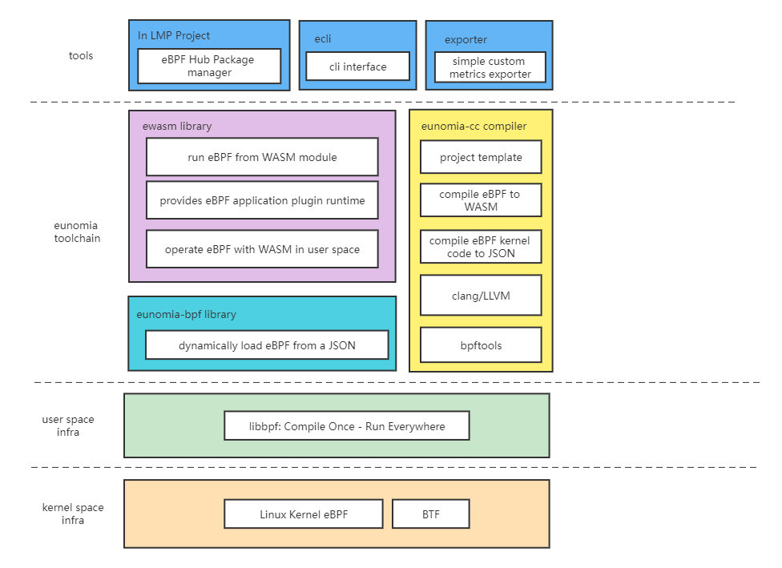
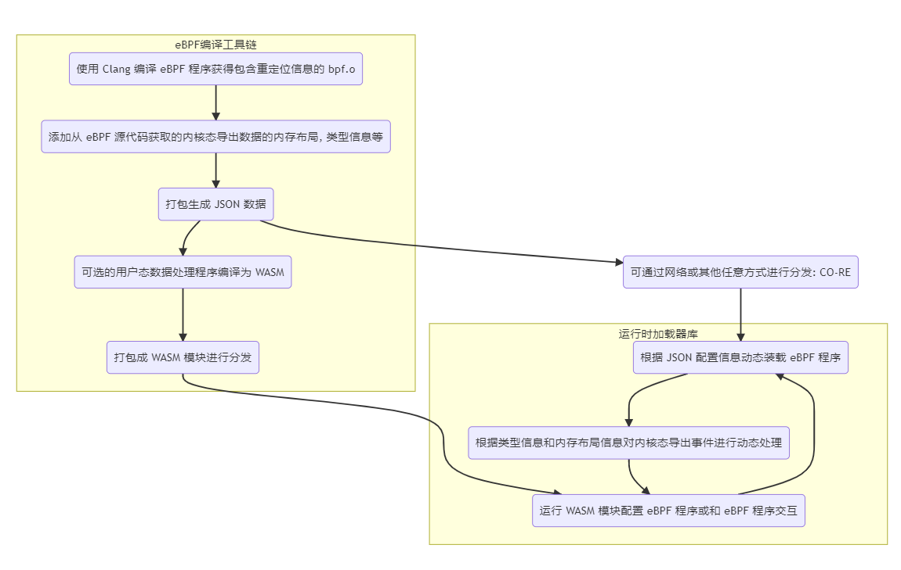

# 工作原理

`ecli` 是基于我们底层的 eunomia-bpf 库和运行时实现的一个简单的命令行工具。我们的项目架构如下图所示：

`ecli` 工具基于 `ewasm` 库实现，`ewasm` 库包含一个 WAMR(wasm-micro-runtime) 运行时，以及基于 libbpf 库构建的 eBPF 动态装载模块。大致来说，我们在 `Wasm` 运行时和用户态的 `libbpf` 中间多加了一层抽象层（`eunomia-bpf` 库），使得一次编译、到处运行的 eBPF 代码可以从 JSON 对象中动态加载。JSON 对象会在编译时被包含在 Wasm 模块中，因此在运行时，我们可以通过解析 JSON 对象来获取 eBPF 程序的信息，然后动态加载 eBPF 程序。

使用 Wasm 或 JSON 编译分发 eBPF 程序的流程图大致如下：

大致来说，整个 eBPF 程序的编写和加载分为三个部分：

1. 用 eunomia-cc 工具链将内核的 eBPF 代码骨架和字节码编译为 JSON 格式
2. 在用户态开发的高级语言（例如 C 语言）中嵌入 JSON 数据，并提供一些 API 用于操作 JSON 形态的 eBPF 程序骨架
3. 将用户态程序和 JSON 数据一起编译为 Wasm 字节码并打包为 Wasm 模块，然后在目标机器上加载并运行 Wasm 程序
4. 从 Wasm 模块中加载内嵌的 JSON 数据，用 eunomia-bpf 库动态装载和配置 eBPF 程序骨架。

我们需要完成的仅仅是少量的 native API 和 Wasm 运行时的绑定，并且在 Wasm 代码中处理 JSON 数据。你可以在一个单一的 `Wasm` 模块中拥有多个 `eBPF` 程序。如果不使用我们提供的 Wasm 运行时，或者想要使用其他语言进行用户态的 eBPF 辅助代码的开发，在我们提供的 `eunomia-bpf` 库基础上完成一些 WebaAssembly 的绑定即可。

另外，对于 eunomia-bpf 库而言，不需要 Wasm 模块和运行时同样可以启动和动态加载 eBPF 程序，不过此时动态加载运行的就只是内核态的 eBPF 程序字节码。你可以手动或使用任意语言修改 JSON 对象来控制 eBPF 程序的加载和参数，并且通过 eunomia-bpf 自动获取内核态上报的返回数据。对于初学者而言，这可能比使用 WebAssembly 更加简单方便：只需要编写内核态的 eBPF 程序，然后使用 eunomia-cc 工具链将其编译为 JSON 格式，最后使用 eunomia-bpf 库加载和运行即可。完全不用考虑任何用户态的辅助程序，包括 Wasm 在内。具体可以参考我们的使用手册[7]或示例代码[8]。
