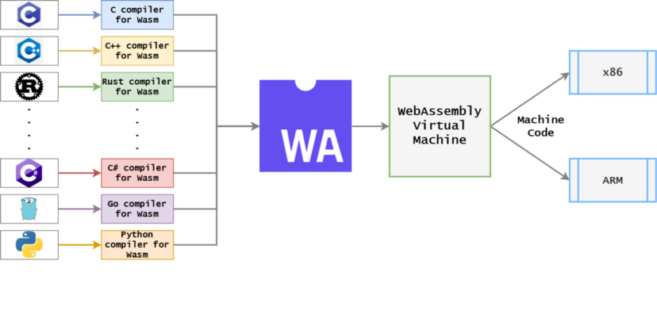

# When Wasm Meets eBPF: Writing, Distributing, Loading, and Running eBPF Programs with WebAssembly

In today's cloud-native world, eBPF and WebAssembly are two of the hottest lightweight code execution sandboxes/virtual machines. Both of them run high-performance bytecode programs compiled from languages such as C, C++, and Rust, and both are cross-platform and portable. The biggest difference between them is that eBPF runs in the Linux kernel, while WebAssembly runs in user space. We want to make an attempt to integrate them: using Wasm to write universal eBPF programs that can be distributed to different versions and architectures of Linux kernels without the need for recompiling.

## WebAssembly vs. eBPF

WebAssembly (abbreviated as Wasm) is a binary instruction format based on a stack-based virtual machine. Wasm is designed for a portable target and can be used as a compilation target for high-level languages such as C/C++/Rust to enable the deployment of client-side and server-side applications on the Web. Wasm has multiple runtime implementations, including browsers and standalone systems, and it can be used in applications such as video and audio codecs, graphics and 3D, multimedia and gaming, cryptographic calculations, or portable language implementations.

Although Wasm was designed as a bytecode standard to improve the performance of performance-sensitive modules on the web, it can be used not only in browsers but also in other environments. Wasm has evolved into a lightweight, high-performance, cross-platform, and multi-language software sandbox environment used in cloud-native software components. Compared to Linux containers, WebAssembly has a startup speed that is 100 times faster, consumes less memory and disk space, and has a better-defined security sandbox. However, the trade-off is that WebAssembly requires its own language SDK and compiler toolchain, making it a more constrained development environment compared to Linux containers. WebAssembly is increasingly being used in edge computing scenarios where deploying Linux containers or application performance is critical.

The compilation and deployment process of Wasm is as follows:



Usually, high-level languages such as C/C++/Rust can be compiled into Wasm bytecode and then loaded and executed in the Wasm virtual machine. The Wasm virtual machine will interpret or JIT the Wasm bytecode into machine code for the corresponding platform (such as x86/arm) to run.

eBPF originated from BPF and is essentially an efficient and flexible virtual machine component in the kernel that executes bytecode in a secure manner at various kernel hook points. Originally designed for efficient network packet filtering, BPF has evolved into a top-level subsystem in the kernel and has become a general-purpose execution engine. Developers can use eBPF to develop performance analysis tools, software-defined networks, security, and many other scenarios. eBPF has some programming restrictions and needs to be validated to ensure its safety in the kernel application scenarios (e.g., no infinite loops, out-of-bounds memory access, etc.), but this also means that the programming model of eBPF is not Turing complete. In contrast, WebAssembly is a Turing complete language with extensions like WebAssembly System Interface (WASI) that can break out of the sandbox and access native OS libraries. At the same time, the Wasm runtime can safely isolate and execute user space code with performance close to native code. There are many differences between the two in terms of their main domains, but there are also many overlapping areas.

There have been attempts to run WebAssembly in the Linux kernel, but they have generally not been successful. eBPF is a better choice for this use case. However, WebAssembly programs can handle many kernel-like tasks and can be compiled ahead of time (AOT) into native applications. WasmEdge Runtime from CNCF is a great LLVM-based cloud-native WebAssembly compiler. Native applications consolidate all sandbox checks into native libraries, allowing WebAssembly programs to behave like standalone "library operating systems." In addition, these AOT-compiled sandboxed WebAssembly applications can run on microkernel operating systems like seL4 and take over many "kernel-level" tasks[1].

While WebAssembly can be brought down to the kernel level, eBPF can also be brought up to the application level. In the sidecar proxy, Envoy Proxy pioneered the use of WebAssembly as an extension mechanism for programming the data plane. Developers can write proxy logic for specific applications in languages such as C, C++, Rust, AssemblyScript, Swift, and TinyGo and compile the module into Wasm. With the proxy-Wasm standard, proxies can execute those Wasm plugins in high-performance runtimes such as Wasmtime and WasmEdge[2].Although many applications currently use both, most of the time these two virtual machines are independent and have no intersection. For example, in an observability application, data is collected using eBPF probes and then data processing is performed by introducing Wasm plugin modules in user space. The distribution, running, loading, and control of Wasm modules and eBPF programs are independent of each other, with only a data flow association.

## Our Attempt

Generally speaking, a complete eBPF application consists of two parts: user space programs and kernel programs:

- User space programs are responsible for loading BPF bytecode into the kernel or reading statistical information or event details returned by the kernel for relevant data processing and control.
- The BPF bytecode in the kernel is responsible for executing specific events in the kernel and may send the execution results to user space through maps or perf-event events.

User space programs can control some parameters and variables of eBPF programs as well as mounting points before loading eBPF programs. They can also communicate bidirectionally between user space and kernel space through maps and other methods. Usually, user space eBPF programs can be developed based on the `libbpf` library to control the loading and running of kernel space eBPF programs. So, if all the control and data processing logic in user space is moved to the Wasm virtual machine, the eBPF bytecode can be packaged and distributed through the Wasm module, and the loading and execution of the entire eBPF program can be controlled internally in the Wasm virtual machine. Perhaps we can combine the advantages of both and allow any eBPF program to have the following features:

- `Portability`: Make eBPF tools and applications completely platform-independent and portable, without the need for recompilation to distribute across platforms.
- `Isolation`: With the reliability and isolation of Wasm, make the loading and execution of eBPF programs and the user space data processing flow more secure and reliable. In fact, the user space control code of an eBPF application is usually much larger than the kernel space code.
- `Package Management`: With the ecosystem and toolchain of Wasm, complete the distribution, management, and loading of eBPF programs or tools. Currently, the eBPF program or tool ecosystem may lack a universal package management or plugin management system.
- `Cross-Language`: Currently, eBPF programs are developed in various user space languages ​​(such as Go\Rust\C\C++\Python, etc.). More than 30 programming languages ​​can be compiled into WebAssembly modules, allowing developers from various backgrounds (C, Go, Rust, Java, TypeScript, etc.) to write user space eBPF programs in their chosen language without the need to learn a new language.
- `Agility`: For large eBPF applications, Wasm can be used as a plugin extension platform: extension programs can be delivered and reloaded directly from the control plane at runtime. This means that everyone can use official and unmodified applications to load custom extensions, and any errors and/or updates to any eBPF program can be pushed and/or tested at runtime without the need to update and/or redeploy a new binary.
- `Lightweight`: WebAssembly microservices consume 1% of resources and have a cold start time of 1% compared to Linux container applications. With this, we may be able to implement eBPF as a service, making the loading and execution of eBPF programs more lightweight, fast, and easy.

eunomia-bpf is a project started and incubated in the "eBPF Technology Exploration SIG" [3] [5]. It is also open source on [Github](https://github.com/eunomia-bpf/eunomia-bpf) [4]. eunomia-bpf is a lightweight development and loading framework for eBPF programs, containing a user space dynamic loading framework/runtime library and a simple toolchain container for compiling Wasm and eBPF bytecode. In fact, writing eBPF code in a Wasm module is basically the same as using the libbpf framework or Coolbpf to develop eBPF programs in the usual familiar way. The complexity of Wasm is hidden in the compilation toolchain and runtime library of eunomia-bpf. Developers can focus on the development and debugging of eBPF programs without the need to understand the background knowledge of Wasm or worry about Wasm's compilation environment configuration.

### Distributing and Dynamically Loading eBPF Programs with Wasm Modules

The eunomia-bpf library includes a simple command-line tool (ecli) that contains a small Wasm runtime module and the ability to dynamically load eBPF. It can be downloaded and used directly:

```console
# download the release from https://github.com/eunomia-bpf/eunomia-bpf/releases/latest/download/ecli
$ wget https://aka.pw/bpf-ecli -O ecli && chmod +x ./ecli
$ sudo ./ecli run https://eunomia-bpf.github.io/eunomia-bpf/sigsnoop/app.wasm"Instructions: Translate the following Chinese text to English 
while maintaining the original formatting: "2022-10-11 14:05:50 URL:https://eunomia-bpf.github.io/eunomia-bpf/sigsnoop/app.wasm [70076/70076] -> "/tmp/ebpm/app.wasm" [1]
running and waiting for the ebpf events from perf event...
{"pid":1709490,"tpid":1709077,"sig":0,"ret":0,"comm":"node","sig_name":"N/A"}
{"pid":1712603,"tpid":1717412,"sig":2,"ret":0,"comm":"kworker/u4:3","sig_name":"SIGINT"}
{"pid":1712603,"tpid":1717411,"sig":2,"ret":0,"comm":"kworker/u4:3","sig_name":"SIGINT"}
{"pid":0,"tpid":847,"sig":14,"ret":0,"comm":"swapper/1","sig_name":"SIGALRM"}
{"pid":1709490,"tpid":1709077,"sig":0,"ret":0,"comm":"node","sig_name":"N/A"}
{"pid":1709139,"tpid":1709077,"sig":0,"ret":0,"comm":"node","sig_name":"N/A"}
{"pid":1717420,"tpid":1717419,"sig":17,"ret":0,"comm":"cat","sig_name":"SIGCHLD"}`"ts":0,"pid":2344,"uid":0,"ret":26,"flags":0,"comm":"YDService","fname":"/proc/1718823/cmdline"}`
`{"ts":0,"pid":2344,"uid":0,"ret":26,"flags":0,"comm":"YDService","fname":"/proc/1718824/cmdline"}`
`{"ts":0,"pid":2344,"uid":0,"ret":26,"flags":0,"comm":"YDService","fname":"/proc/self/stat"}`

opensnoop tracks the `open()` system call of a process, which means all file opening operations in the kernel. Here we can see process information such as PID, UID, return value, flags, process name, and file name. The eBPF program in kernel space is distributed within a Wasm module and is relocated using BTF information and libbpf during loading to adapt to different kernel versions. Additionally, because the user-space related processing code is entirely written in Wasm and the kernel-space is written in eBPF instructions, it is not restricted by specific instruction sets (e.g., x86, ARM) and can run on different platforms.

### Developing and Packaging eBPF Programs with Wasm

Similarly, taking the example of sigsnoop mentioned earlier for tracking signal sending and receiving of a process, we first need to write the eBPF code in the kernel space in `sigsnoop.bpf.c`:

```c
#include <vmlinux.h>
#include <bpf/bpf_helpers.h>
#include "sigsnoop.h"

const volatile pid_t filtered_pid = 0;
.....

struct {
 __uint(type, BPF_MAP_TYPE_PERF_EVENT_ARRAY);
 __uint(key_size, sizeof(__u32));
 __uint(value_size, sizeof(__u32));
} events SEC(".maps");

SEC("tracepoint/signal/signal_generate")
int sig_trace(struct trace_event_raw_signal_generate *ctx)
{
 struct event event = {};
 pid_t tpid = ctx->pid;
 int ret = ctx->errno;
 int sig = ctx->sig;
 __u64 pid_tgid;
 __u32 pid;

 ...
 pid_tgid = bpf_get_current_pid_tgid();
 pid = pid_tgid >> 32;
 if (filtered_pid && pid != filtered_pid)
  return 0;

 event.pid = pid;
 event.tpid = tpid;
 event.sig = sig;
 event.ret = ret;
 bpf_get_current_comm(event.comm, sizeof(event.comm));
 bpf_perf_event_output(ctx, &events, BPF_F_CURRENT_CPU, &event, sizeof(event));
 return 0;
}

char LICENSE[] SEC("license") = "Dual BSD/GPL";
```

Here, we use the `tracepoint/signal/signal_generate` tracepoint to track the signal generation events in the kernel. The kernel code exports information to user space using `BPF_MAP_TYPE_PERF_EVENT_ARRAY`. Therefore, we need to define a structure for exporting information in the `sigsnoop.h` header file:

```c
#ifndef __SIGSNOOP_H
#define __SIGSNOOP_H

#define TASK_COMM_LEN 16

struct event {
 unsigned int pid;
 unsigned int tpid;
 int sig;
 int ret;
 char comm[TASK_COMM_LEN];
};

#endif /* __SIGSNOOP_H */
```

We can compile it into JSON format using the eunomia-bpf toolchain, generate a `package.json` file, and directly run it using the ecli command:

```console".```console
$ docker run -it -v `pwd`/:/src/ ghcr.io/eunomia-bpf/ecc-`uname -m`:latest
make
  BPF      .output/client.bpf.o
  GEN-SKEL .output/client.skel.h
  CC       .output/client.o
  CC       .output/cJSON.o
  CC       .output/create_skel_json.o
  BINARY   client
  DUMP_LLVM_MEMORY_LAYOUT
  DUMP_EBPF_PROGRAM
  FIX_TYPE_INFO_IN_EBPF
  GENERATE_PACKAGE_JSON

$ sudo ./ecli run package.json
running and waiting for the ebpf events from perf event...
time pid tpid sig ret comm
14:39:39 1723835 1723834 17 0 dirname
14:39:39 1723836 1723834 17 0 chmod
14:39:39 1723838 1723837 17 0 ps
14:39:39 1723839 1723837 17 0 grep
14:39:39 1723840 1723837 17 0 grep
14:39:39 1723841 1723837 17 0 wc
```

All of our build toolchains have been packaged as Docker images and published to Docker Hub, 
so they can be used directly. At this time, only the kernel-space eBPF code and some auxiliary information are dynamically loaded and executed, 
helping the eunomia-bpf library automatically obtain events reported from kernel-space to user-space. 
If we want to perform some parameter configuration and adjustment in user-space, as well as data processing, 
we need to write code in user-space and package the kernel-space eBPF code and user-space code into a complete eBPF program.

A one-liner command can directly generate a user-space WebAssembly development framework for eBPF programs:

```console
$ docker run -it -v `pwd`/:/src/ ghcr.io/eunomia-bpf/ecc-`uname -m`:latest gen-wasm-skel
make
  GENERATE_PACKAGE_JSON
  GEN-Wasm-SKEL
$ ls
app.c eunomia-include ewasm-skel.h package.json README.md  sigsnoop.bpf.c  sigsnoop.h
```

The Wasm development framework we provide is written in C and includes the following files:

- ewasm-skel.h: the header file of the user-space WebAssembly development framework, 
  which contains the pre-compiled eBPF program bytecode and the eBPF program framework auxiliary information for dynamic loading;
- eunomia-include: some header-only library functions and auxiliary files to assist development;
- app.c: the main code of the user-space WebAssembly program, which includes the main logic of the eBPF program and the data processing flow of the eBPF program.

Take `sigsnoop` as an example. In user-space, it includes some code for command line parsing, configuring the eBPF program, and data processing. 
It adds the English names of signal events based on the signal number:

```c
....
int main(int argc, const char** argv)
{
  struct argparse_option options[] = {
        OPT_HELP(),
        OPT_BOOLEAN('x', "failed", &failed_only, "failed signals only", NULL, 0, 0),
        OPT_BOOLEAN('k', "killed", &kill_only, "kill only", NULL, 0, 0),
        OPT_INTEGER('p', "pid", &target_pid, "target pid", NULL, 0, 0),
  OPT_INTEGER('s', "signal", &target_signal, "target signal", NULL, 0, 0),
        OPT_END(),
    };

  struct argparse argparse;
  argparse_init(&argparse, options, usages, 0);".
format: contentargparse_describe(&argparse, "Trace standard and real-time signals.\n", "");
  argc = argparse_parse(&argparse, argc, argv);

  cJSON *program = cJSON_Parse(program_data);
  program = set_bpf_program_global_var(program, "filtered_pid", cJSON_CreateNumber(target_pid));
  program = set_bpf_program_global_var(program, "target_signal", cJSON_CreateNumber(target_signal));
  program = set_bpf_program_global_var(program, "failed_only", cJSON_CreateBool(failed_only));
  return start_bpf_program(cJSON_PrintUnformatted(program));
}

int process_event(int ctx, char *e, int str_len)
{
 cJSON *json = cJSON_Parse(e);
 int sig = cJSON_GetObjectItem(json, "sig")->valueint;
 const char *name = sig_name[sig];
 cJSON_AddItemToObject(json, "sig_name", cJSON_CreateString(name));
 char *out = cJSON_PrintUnformatted(json);
 printf("%s\n", out);
 return 0;
}
```

Finally, the use of container images can complete the compilation and packaging of WebAssembly/eBPF programs in one command. Use ecli to run with one click:

```console
$ docker run -it -v `pwd`/:/src/ ghcr.io/eunomia-bpf/ecc-`uname -m`:latest build-wasm
make
  GENERATE_PACKAGE_JSON
  BUILD-Wasm
build app.wasm success
$ sudo ./ecli run app.wasm -h
Usage: sigsnoop [-h] [-x] [-k] [-n] [-p PID] [-s SIGNAL]
```

Since we use the libbpf framework to load and start eBPF programs based on one-time compilation and universal execution, the compilation and execution steps are completely separate. eBPF programs can be distributed and deployed directly over the network or any other means, without relying on specific kernel versions. With the lightweight nature of WebAssembly, the startup speed of eBPF programs is also much faster than that of libbpf programs distributed in image form, usually taking less than 100 ms to complete. Compared to the time and resources consumed by LLVM and Clang for compiling and running when deploying and starting with BCC, it is a qualitative leap.

For the complete code of the example program mentioned above, you can refer to here [6].

### Demo video

We also have a demonstration video on Bilibili, which demonstrates how to port an eBPF tool program from bcc/libbpf-tools to eunomia-bpf and distribute and load eBPF programs using Wasm or JSON files: [https://www.bilibili.com/video/BV1JN4y1A76k](https://www.bilibili.com/video/BV1JN4y1A76k)

## How we did it

`ecli` is a simple command-line tool based on our underlying eunomia-bpf library and runtime implementation. Our project architecture is shown in the following diagram:


The `ecli` tool is implemented based on the `ewasm` library, which includes a WAMR (wasm-micro-runtime) runtime and an eBPF dynamic loading module built on the libbpf library. In general, we added a layer of abstraction (eunomia-bpf library) between the `Wasm` runtime and user-space `libbpf`, so that eBPF code that can be compiled and run once can be dynamically loaded from a JSON object. The JSON object is included in the Wasm module at compile time, so at runtime, we can parse the JSON object to retrieve information about the eBPF program and then dynamically load the eBPF program.The process of compiling and distributing eBPF programs using Wasm or JSON can be roughly summarized as follows:


In general, the writing and loading of the entire eBPF program can be divided into three parts:

1. Use the eunomia-cc toolchain to compile the eBPF code skeleton and bytecode of the kernel into JSON format.
2. Embed JSON data in a high-level language (such as C) developed in user space, and provide some APIs to manipulate the JSON-formatted eBPF program skeleton.
3. Compile the user space program and JSON data into Wasm bytecode and package it as a Wasm module, then load and run the Wasm program on the target machine.
4. Load the embedded JSON data from the Wasm module and dynamically load and configure the eBPF program skeleton using the eunomia-bpf library.

What we need to do is only a small amount of native API and Wasm runtime bindings, and process JSON data in Wasm code. You can have multiple eBPF programs in a single Wasm module. If you don't want to use our provided Wasm runtime or want to develop user-space eBPF auxiliary code in another language, you can complete some WebAssembly bindings based on our eunomia-bpf library.

In addition, for the eunomia-bpf library, it is not necessary to have a Wasm module and runtime to start and dynamically load eBPF programs. In this case, only the bytecode of the eBPF program in kernel space will be dynamically loaded and run. You can manually or using any language modify the JSON object to control the loading and parameters of the eBPF program, and obtain the returned data automatically through eunomia-bpf. For beginners, this may be simpler and more convenient than using WebAssembly: just write the eBPF program in kernel space, then use the eunomia-cc toolchain to compile it into JSON format, and finally load and run it using the eunomia-bpf library. There is no need to consider any user-space auxiliary programs, including WebAssembly. For specific details, please refer to our user manual [7] or sample code [8].

## Future directions

Currently, the implementation of the eunomia-bpf toolchain is far from perfect, there is only a version for feasibility verification. For a development toolchain, specific API standards and related ecosystems are very important. If there is an opportunity, we hope that we can discuss with other members of the SIG community to form a specific API standard, which can provide a common, cross-platform, and kernel version plugin ecosystem based on technologies such as eBPF and Wasm, to add eBPF and Wasm capabilities to their respective applications.

Currently, the cross-kernel version dynamic loading feature of eunomia-bpf depends on the BTF information of the kernel. The Coolbpf project [9] of the SIG community itself can provide automatic generation of BTF and adaptation for low version kernels. Future support for low version kernels will be based on the existing part of Coolbpf. At the same time, we will provide similar features to the eunomia-bpf library for the Coolbpf API implementation and remote compilation backend, so that programs developed using the Coolbpf API can be used directly on any kernel version and architecture after remote compilation, without the need to connect to remote servers again during deployment. The compiled eBPF program can also be used directly as a development package for languages such as Go, Python, and Rust, allowing developers to easily obtain the information reported by the eBPF program without the need for any compilation process for the eBPF program.

The SIG community is incubated in the Linux Microscope (LMP) project [10] in universities, and there are also plans to provide common, standardized, downloadable and runnable eBPF programs or tool libraries based on eunomia-bpf, which are currently being further improved.

## References

1. eBPF and WebAssembly: Which VM Will Dominate the Cloud-Native Era? [https://juejin.cn/post/7043721713602789407](https://juejin.cn/post/7043721713602789407)
2. eBPF and Wasm: Exploring the Future of the Service Mesh Data Plane: [https://cloudnative.to/blog/ebpf-wasm-service-mesh/](https://cloudnative.to/blog/ebpf-wasm-service-mesh/)
3. eBPF Technology Exploration SIG Homepage: [https://openanolis.cn/sig/ebpfresearch](https://openanolis.cn/sig/ebpfresearch)
4. eunomia-bpf GitHub repository: <https://github.com/eunomia-bpf/eunomia-bpf>.5. eunomia-bpf Mirror Repository: [https://gitee.com/anolis/eunomia](https://gitee.com/anolis/eunomia)
6. sigsnoop Sample Code: <https://gitee.com/anolis/eunomia/tree/master/examples/bpftools/sigsnoop>
7. eunomia-bpf User Manual: <https://openanolis.cn/sig/ebpfresearch/doc/646023027267993641>
8. More Sample Code: <https://gitee.com/anolis/eunomia/tree/master/examples/bpftools/sigsnoop>
9. Coolbpf Project Introduction: <https://openanolis.cn/sig/ebpfresearch/doc/633529753894377555>
10. LMP Project Introduction: <https://openanolis.cn/sig/ebpfresearch/doc/633661297090877527>