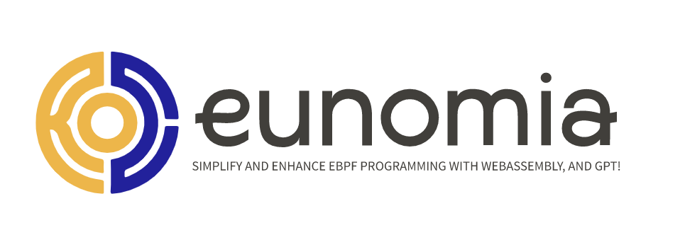

# eunomia-bpf: simplify and enhance eBPF with CO-RE[^1] and WebAssembly[^2]

**A compiler and runtime framework to help you build and distribute eBPF program easier.**

## Introduction

`eunomia-bpf` is a dynamic loading library/runtime and a compile toolchain framework, aim at helping you build and distribute eBPF programs easier.

With eunnomia-bpf, you can:

- A library to simplify `writing` eBPF programs:
  - simplify building CO-RE[^1] `libbpf` eBPF applications: [write eBPF kernel code only](https://github.com/eunomia-bpf/eunomia-bpf/tree/master/documents/introduction.md#simplify-building-co-re-libbpf-ebpf-applications) and automatically exposing your data with `perf event` or `ring buffer` from kernel.
  - [Automatically sample the data](https://github.com/eunomia-bpf/eunomia-bpf/tree/master/documents/introduction.md#automatically-sample-the-data-and-print-hists-in-userspace) from hash maps and print `hists` in userspace.
  - [Automatically generate](https://github.com/eunomia-bpf/eunomia-bpf/tree/master/documents/introduction.md#automatically-generate-and-config-command-line-arguments) and config `command line arguments` for eBPF programs.
  - You can writing the kernel part in both `BCC` and `libbpf` styles.
- Build eBPF programs with `Wasm`[^2]: see [`Wasm-bpf`](https://github.com/eunomia-bpf/wasm-bpf) project
  - Runtime, libraries and toolchains to [write eBPF with Wasm](https://github.com/eunomia-bpf/wasm-bpf) in C/C++, Rust, Go...covering the use cases from `tracing`, `networking`, `security`.
- simplify `distributing` eBPF programs:
  - A [tool](https://github.com/eunomia-bpf/eunomia-bpf/tree/master/ecli) for push, pull and run pre-compiled eBPF programs as `OCI` images in Wasm module
  - Run eBPF programs from `cloud` or `URL` within [`1` line of bash](https://github.com/eunomia-bpf/eunomia-bpf/tree/master/documents/introduction.md#dynamic-load-and-run-co-re-ebpf-kernel-code-from-the-cloud-with-url-or-oci-image) without recompiling, kernel version and architecture independent.
  - [Dynamically load](https://github.com/eunomia-bpf/eunomia-bpf/tree/master/bpf-loader-rs) eBPF programs with `JSON` config file or `Wasm` module.

For more information, see [next](introduction.md).

[^1]: CO-RE: [Compile Once – Run Everywhere](https://facebookmicrosites.github.io/bpf/blog/2020/02/19/bpf-portability-and-co-re.html)
[^2]: WebAssembly or Wasm: <https://webassembly.org/>
